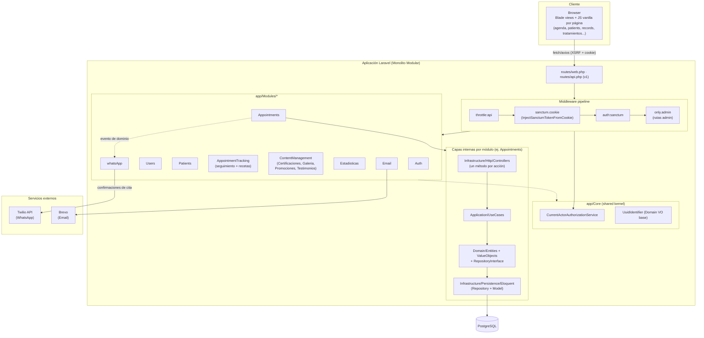
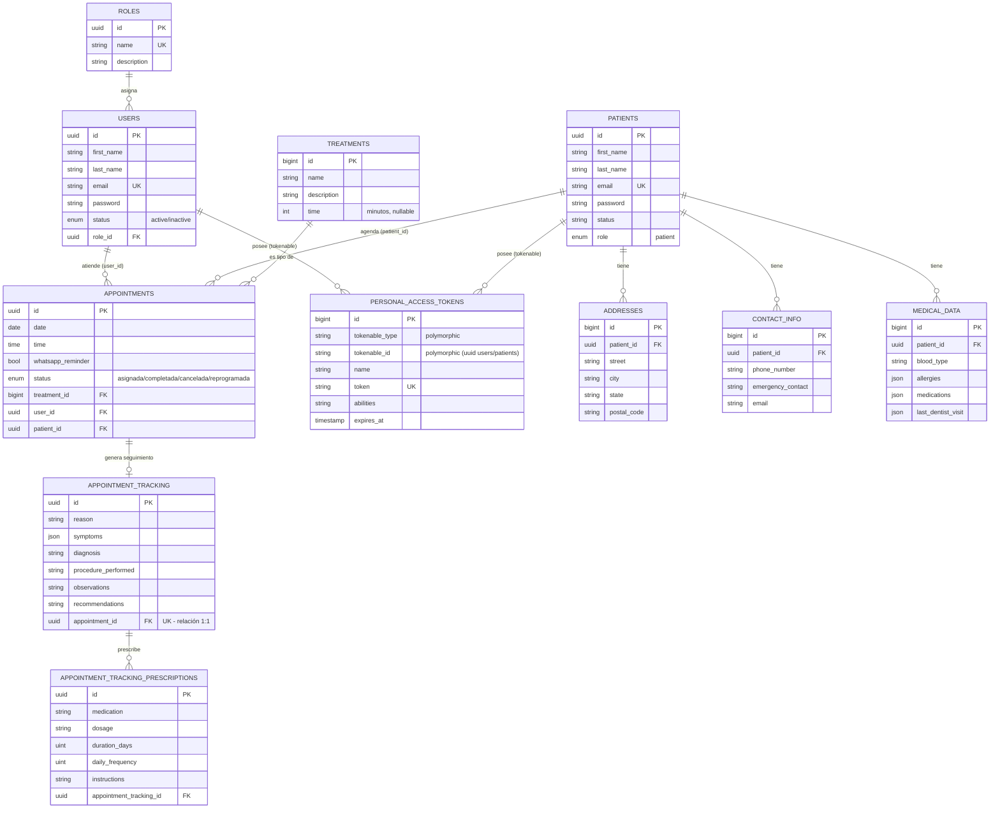
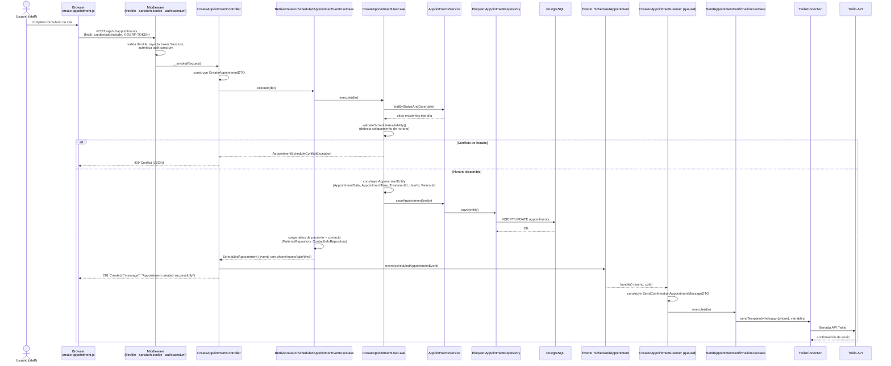

# Arquitectura de DentissaApp

Documento técnico generado a partir de un análisis estático del código (Laravel 12 / PHP 8.2). Describe el patrón arquitectónico, el modelo de datos y el flujo del caso de uso principal.

## 1. Resumen técnico

**Stack tecnológico**

| Capa | Tecnología |
|---|---|
| Backend | Laravel 12, PHP ^8.2 |
| Autenticación | Laravel Sanctum 4 (modo SPA/cookie, sin Policies — autorización custom) |
| Base de datos | PostgreSQL (`config/database.php`, `DB_CONNECTION` por defecto `pgsql`) |
| Cola / Cache | Predis (Redis) |
| Integraciones externas | Twilio (WhatsApp), Brevo (email transaccional) |
| Frontend | Blade + JS vanilla por página ("pages" pattern), Axios/fetch, Vite 7, Tailwind CSS 4 |

**Patrón arquitectónico**: **Monolito Modular** con capas internas de **Arquitectura Hexagonal / Clean Architecture** (`Domain / Application / Infrastructure`) por módulo. No existe un `app/Http/Controllers` central: cada módulo bajo `app/Modules/*` es autocontenido, con sus propias entidades de dominio, value objects, casos de uso, interfaces de repositorio, implementaciones Eloquent y migraciones. Un *shared kernel* en `app/Core` centraliza autorización (`CurrentActorAuthorizationService`), un value object base para IDs (`UuidIdentifier`) y middlewares transversales.

Módulos identificados: `Auth`, `Users`, `Patients`, `Appointments`, `AppointmentTracking` (seguimiento clínico/recetas, el más reciente), `ContentManagement` (con submódulos `Certificaciones`, `Galeria`, `Promociones`, `Testimonios`), `Estadisticas`, `Email`, `whatsApp`.

**Flujo de datos general**

```
Browser (Blade + JS por página)
   → routes/web.php (vistas)  |  routes/api.php (JSON, prefijo /v1)
   → Middleware (throttle:api → sanctum.cookie → auth:sanctum → only.admin)
   → Controller de un solo método (Infrastructure/Http/Controllers)
   → UseCase (Application) — orquesta reglas de negocio
   → Entidad / Value Objects (Domain) — validan invariantes
   → Repository Interface (Domain) → Eloquent Repository (Infrastructure)
   → PostgreSQL
   → (efectos secundarios) Evento de dominio → Listener en cola → Twilio / Brevo
```

**Puntos de entrada clave (Controllers/Endpoints)**

- `CreateAppointmentController`, `CompleteAppointmentController` — ciclo de vida de citas.
- `UpdateAppointmentTrackingController`, controladores de `Prescription*` — seguimiento clínico y recetas.
- `GetPatientByIdController` y CRUD de `Patients` (direcciones, contacto, datos médicos, expediente).
- CRUD de `Users`, `Treatments`.
- CRUD por submódulo de `ContentManagement` (Certificaciones, Galería, Promociones, Testimonios) — públicos en lectura, `only.admin` en escritura.
- `Auth`: login, register, logout, reset de contraseña.

**Autorización**: no usa Laravel Policies. `App\Core\Authorization\CurrentActorAuthorizationService::assertCan()` valida que el usuario autenticado esté activo y, para permisos administrativos, que su rol sea `administrador` contra una lista blanca hardcodeada. Las rutas de agenda/citas solo requieren `auth:sanctum` (cualquier staff autenticado), no `only.admin`.

---

## 2. Diagrama de Arquitectura / Visión General del Sistema



---

## 3. Diagrama Entidad-Relación de la Base de Datos

Núcleo clínico/operativo (sin tablas pivote — todas las relaciones son 1:N, con una 1:1 entre `appointments` y `appointment_tracking`):



> Nota: el módulo `ContentManagement` mantiene tablas independientes (`certifications`, `galery_images`, `promotions`, `testimonials`) para contenido público del sitio (certificaciones, galería, promociones, testimonios). No tienen relación con el dominio clínico y se omiten del ERD para mantenerlo legible.

---

## 4. Diagrama de Secuencia — Caso de uso principal: Crear cita con confirmación por WhatsApp

Flujo real trazado desde `resources/js/pages/agenda/create-appointment.js` hasta la persistencia y el envío de WhatsApp vía Twilio.



**Notas del flujo**

- No existen `FormRequest` ni `Policy` classes en el proyecto: la validación ocurre en los Value Objects de dominio (lanzan `ValueObjectsException`) y la autorización pasa por `CurrentActorAuthorizationService`.
- El envío de WhatsApp es **asíncrono** (`CreatedAppointmentListener implements ShouldQueue`, 3 intentos, backoff 15s) y no bloquea la respuesta HTTP al usuario.
- Si el paciente no tiene teléfono registrado, el listener omite el envío sin fallar la creación de la cita.
