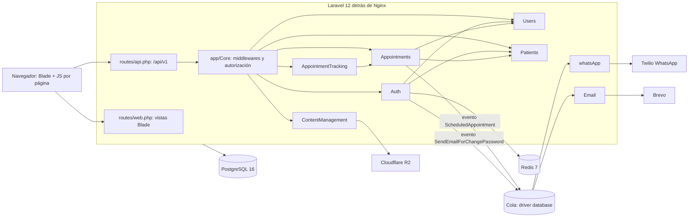

# Arquitectura de Dentissa

## Resumen
Dentissa es un **monolito modular** en Laravel 12 (PHP 8.4). Cada dominio de negocio vive en
`app/Modules/<Módulo>` con capas hexagonales: `Domain` (entidades, value objects, interfaces de
repositorio, servicios, eventos), `Aplication`/`Application` (DTOs, casos de uso) e
`Infrastructure` (controladores invocables, FormRequests, API Resources, Eloquent, migraciones,
listeners, clientes externos). `app/Core` es el kernel compartido (autorización, middlewares,
`UuidIdentifier`). El frontend son vistas Blade servidas por `routes/web.php` con un archivo JS
vanilla por página que consume `/api/v1` con `fetch`. Se eligió así para aislar dominios sin el
coste operativo de microservicios (ver [ADR 0002](adr/0002-monolito-modular-laravel.md)).

## Diagrama de componentes

Texto alternativo: el navegador llama a las vistas web y a la API `/api/v1`; la API pasa por los
middlewares de `app/Core` hacia los módulos. Appointments y Auth emiten eventos que se procesan en
cola por los módulos whatsApp (Twilio) y Email (Brevo). ContentManagement guarda imágenes en R2.
Auth guarda tokens de reset en Redis. Todos persisten en PostgreSQL.

## Módulos
| Módulo | Ruta | Responsabilidad | Depende de |
|---|---|---|---|
| Core | `app/Core` | `CurrentActorAuthorizationService::assertCan`, middlewares `OnlyAdmin` e `InjectSanctumTokenFromCookie`, `UuidIdentifier`, `TrimsPasswordFields` | Users (modelo y roles) |
| Auth | `app/Modules/Auth` | Login unificado staff/paciente, registro público de pacientes, logout, reset de contraseña | Users, Patients, Core |
| Users | `app/Modules/Users` | CRUD del personal (Administrador, Asistente, Doctor) y roles | Core |
| Patients | `app/Modules/Patients` | Pacientes, contacto, dirección, datos médicos y expediente consolidado | Core |
| Appointments | `app/Modules/Appointments` | Citas, disponibilidad sin solapamiento, catálogo de tratamientos, catálogos de agenda | Patients, Users, Core |
| AppointmentTracking | `app/Modules/AppointmentTracking` | Completar cita con seguimiento clínico y recetas | Appointments, Core |
| ContentManagement | `app/Modules/ContentManagement` | Landing y CRUD de certificaciones, galería, promociones y testimonios (submódulos en `Modules/`) | Core |
| Email | `app/Modules/Email` | Correo transaccional de reset vía Brevo (listener en cola) | Auth (evento) |
| whatsApp | `app/Modules/whatsApp` | Confirmación de cita por plantilla Twilio (listener en cola) | Appointments (evento) |
| Estadisticas | `app/Modules/Estadisticas` | Vacío: sin código | — |

## Flujo principal
Crear una cita:
1. `resources/js/pages/agenda/create-appointment.js` hace `POST /api/v1/appointments` con `credentials: 'include'`.
2. Middlewares: `throttle:api` → `InjectSanctumTokenFromCookie` (cookie `auth_token` → `Authorization: Bearer`) → `auth:sanctum`.
3. `CreateAppointmentController` (sin FormRequest) construye `CreateAppointmentDTO` y llama a `RetriveDataForScheduledAppointmenEventUseCase`.
4. `CreateAppointmentUseCase` crea los value objects, verifica disponibilidad con `ScheduleAvailabilityChecker` y persiste vía `AppointmentsService` → `AppointmentsRepositoryInterface` → `EloquentAppointmentRepository`.
5. Se lee el paciente y su contacto, se dispara `ScheduledAppointment` y se responde 201.
6. `CreatedAppointmentListener` (`ShouldQueue`, 3 intentos, 15 s de espera) envía la plantilla de Twilio.

## Datos
- Motor: PostgreSQL 16 (`config/database.php` por defecto `pgsql`; `.env.example` trae `sqlite`, ver deuda).
- ORM: Eloquent, con modelos dentro de cada módulo (`Infrastructure/Persistence/Eloquent/Models`); `app/Models` está vacío.
- Migraciones: por módulo en `Infrastructure/Persistence/Eloquent/Migrations`, cargadas con `loadMigrationsFrom` en `AppServiceProvider::boot`; `database/migrations` solo tiene tablas técnicas (cache, jobs, tokens).
- Entidades: Role, User (uuid), Patient (uuid), ContactInfo, Address, MedicalData (1:1 con paciente), Treatment, Appointment (uuid, estados `asignada`/`reprogramada`/`completada`/`cancelada`), AppointmentTracking (1:1 con cita), Prescription, Certification, GalleryImage (`galery_images`), Promotion, Testimonial.
- Seeder: `RoleSeeder` fija los roles 1/2/3.

## Integraciones externas
- **Twilio** (`twilio/sdk` 8.11.6): WhatsApp saliente, `app/Modules/whatsApp/Infrastructure/ExternalApi/TwilioConection.php`.
- **Brevo** (`getbrevo/brevo-php` 4.0.16): correo de reset, `app/Modules/Email/Infrastructure/ExternalApi/BrevoApi.php`.
- **Cloudflare R2** vía disco `s3` (`league/flysystem-aws-s3-v3`): imágenes de contenido, `app/Modules/ContentManagement/StorageProvider.php`.
- **Redis** (Predis): tokens de reset de contraseña con TTL de 15 min.
- No hay webhooks entrantes.

## Frontend
- Componentes y organización: `resources/views/layouts/{admin,app,dashboard,landing,patient}`, componentes Blade en `components/{ui,calendar,landing,records}` (`<x-ui.input>`), páginas en `pages/<sección>/index.blade.php` con modales hermanos.
- JS: un archivo por página en `resources/js/pages/<sección>/<acción>.js`, cada uno declarado a mano como entrada en `vite.config.js`; `fetch` a `/api/v1`. Hay JS inline en algunas vistas (login, register, usuarios).
- Estado: sin librería de estado; cada página mantiene su estado en el DOM.
- Routing: rutas web en español (`/agenda`, `/pacientes`, `/expedientes-clinicos`, `/contenido`) definidas como closures en `routes/web.php`.
- Design tokens / sistema de diseño: Tailwind 4 CSS-first (`resources/css/app.css` con `@theme`); sin modo oscuro.
- Accesibilidad: objetivo **WCAG 2.1 AA** para pantallas nuevas o modificadas (decisión del 2026-09-22). Las pantallas existentes no se han auditado.

## Backend
- Contratos de API: no hay OpenAPI. El contrato implícito son los `JsonResource` de cada módulo; forma de respuesta `{"message"}` en escrituras, `{"error"}` en errores y `{"data": [...]}` en lecturas.
- Autenticación y autorización: tokens personales de Sanctum en cookie `auth_token` (httpOnly); middleware `only.admin` y `assertCan` para permisos (solo el administrador tiene permisos en la lista actual). Detalle y riesgos en [security.md](security.md).
- Observabilidad: logs de Laravel en `storage/logs/laravel.log` (`stack` → `single`); Alloy → Loki → Grafana (`docker-compose.yml`) recoge solo el stdout/stderr de los contenedores, así que hoy **no** recibe los logs de la aplicación; health check `/up`; sin métricas, correlación ni auditoría. Detalle en [observability.md](observability.md).
- Seguridad: rate limiting `throttle:api` (10/min por IP sin autenticar, 100/min por usuario); ver [security.md](security.md).

## Contrato entre capas
- Fuente de verdad: los `JsonResource` y las rutas de `routes/api.php`; no hay tipos compartidos con el JS. Desde esta constitución (P4), el contrato de cada endpoint nuevo o modificado se escribe en su spec o plan.
- Versionado: prefijo `/api/v1`; un cambio incompatible pasa a `/api/v2`.
- Cómo se regenera: no aplica (no hay generación de tipos).

## Despliegue
Hoy solo existe el entorno local con Docker Compose (php-fpm, nginx, PostgreSQL, Redis, Loki,
Grafana, Alloy). Está planificado un VPS con la misma composición y despliegue manual. El detalle
está en [deployment.md](deployment.md).

## Evidencia (solo si status=inferred)
| Afirmación | Archivos | Confianza |
|---|---|---|
| Monolito modular con capas hexagonales | `app/Modules/*/{Domain,Aplication,Infrastructure}` | alta |
| Bindings interfaz → Eloquent centralizados | `app/Providers/AppServiceProvider.php` | alta |
| Rutas centralizadas, sin rutas por módulo | `routes/api.php`, `routes/web.php`, `bootstrap/app.php` | alta |
| Migraciones por módulo | `AppServiceProvider::boot` | alta |
| Auth por token Sanctum en cookie | `bootstrap/app.php:23-27`, `app/Core/Middlewares/InjectSanctumTokenFromCookie.php` | alta |
| Efectos laterales por eventos en cola | `app/Providers/EventServiceProvider.php`, `app/Modules/whatsApp/Infrastructure/Listeners/CreatedAppointmentListener.php` | alta |
| Posible doble registro de listeners | `bootstrap/app.php:9-12` + `EventServiceProvider::$listen` | media |
| Frontend con JS por página | `vite.config.js`, `resources/js/pages/*` | alta |

## Deuda técnica y riesgos observados
- Grafía de capas inconsistente: `Aplication` (mayoría) frente a `Application` (AppointmentTracking, raíz de ContentManagement); `Http` frente a `HTTP` (ContentManagement).
- Fugas de capa: `TreatmentsService` importa `EloquentTreatmentRepository`; `LoginService` y `LogoutUseCase` usan modelos Eloquent y facades; varios UseCases de Patients saltan el Domain Service.
- Imports cruzados sobrantes: `SendEmailForChangePasswordEvent` importa `AppointmentEntity`; `SendPasswordResetListener` importa clases de Appointments y whatsApp.
- Posible doble ejecución de listeners (descubrimiento automático + `$listen`); verificar con `php artisan event:list`.
- Validación con FormRequest solo en Auth y Users; el resto valida en value objects.
- 48 controladores devuelven `$e->getMessage()` en respuestas 500.
- `env()` fuera de `config/` en Twilio y Brevo (se rompe con `config:cache`).
- `.env.example` usa `sqlite` y `REDIS_CLIENT=phpredis`, pero el proyecto usa PostgreSQL y Predis; el Dockerfile no instala la extensión redis.
- No hay worker de colas ni scheduler en `docker-compose.yml`; los listeners `ShouldQueue` requieren `queue:work`.
- `app/Modules/Estadisticas` y `Modules/` en la raíz están vacíos; `DatabaseSeeder` referencia `App\Models\User`, que no existe.
- README y `ARCHITECTURE.md` declaran PHP 8.2 y PHPUnit; el proyecto usa PHP 8.4 y Pest 3.
