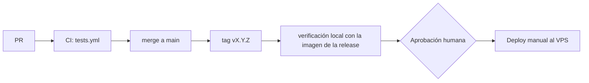

# Despliegue de Dentissa

> Regla innegociable: ningún deploy a producción sin aprobación humana explícita del dueño del
> repositorio.

**Estado actual:** producción en un droplet de DigitalOcean (`dentissapp.com`, detrás de
Cloudflare). Versión en servicio: **v0.1.0**, desplegada el 2026-10-04 con `docker/prod/deploy.sh`
(specs 014 y 015). El procedimiento se ensayó en local (T058) y en el droplet (T050–T054, T076,
T088). La pila manual anterior sigue en el droplet, detenida, como vuelta atrás del primer paso
hasta que se retire ("Retirar la pila manual").

## Entornos
| Entorno | URL | Rama / disparador | Aprobación | Datos |
|---|---|---|---|---|
| local | http://localhost:8000 | cualquier rama; `docker compose up -d --build` | ninguna | ficticios |
| staging | — | no existe | — | — |
| prod | https://dentissapp.com | tag `vX.Y.Z` de `main`, desplegado a mano con `docker/prod/deploy.sh` | **humana (dueño del repo)** | reales (solo tras cerrar el objetivo 1 del roadmap) |

Sin staging, P12 exige que cada release pase la suite completa en CI y una verificación manual en
local con la imagen de la release antes de ir a producción.

## Plataforma e infraestructura
- **Local:** `docker-compose.yml` con `app` (etapa `dev` de `docker/Dockerfile`: php:8.4-fpm-alpine con Node y Composer, código montado), `queue`, `nginx` (8000:80, sin TLS), `vite` en `127.0.0.1:5173`, `db` (postgres:16) y `redis` (7-alpine) solo en `127.0.0.1`, y observabilidad `loki` + `grafana` (`127.0.0.1:3000`) + `alloy`. `vendor/` y `node_modules/` viven en volúmenes con nombre.
- **Prod:** droplet de DigitalOcean (1 vCPU, 2 GB de RAM y 2 GB de swap), usuario `deploy`, `ufw` con solo 22, 80 y 443.
  - **Cloudflare** delante: proxy activo, SSL/TLS en **Full (strict)** y "Always Use HTTPS". Laravel (`config/security.php`, `trusted_proxies`) y nginx (`docker/nginx/prod.conf`, `set_real_ip_from` con `CF-Connecting-IP`) confían solo en los rangos publicados por Cloudflare para obtener la IP real (CA16, CA17). Los rangos se revisan cada seis meses y en cada release contra https://www.cloudflare.com/ips/; la copia actual es del 2026-09-29.
  - **Imágenes inmutables** (ADR 0004): `dentissa-app:<tag>` (etapa `prod`: código, `vendor` sin dependencias de desarrollo, assets compilados, `php.ini` con `expose_php=Off` y `zend.exception_ignore_args=On`, sin root) y `dentissa-web:<tag>` (nginx con TLS, cabeceras y `public/`). Se construyen en el droplet desde el clon; se conservan las dos últimas versiones.
  - **`docker-compose.prod.yml`** (proyecto `dentissa`): `app`, `queue` (`queue:work`), `nginx` (único servicio con 80 y 443), `db`, `redis` con contraseña, `loki`, `grafana` (`127.0.0.1:3000`, solo por túnel SSH) y `alloy`. Los volúmenes de datos son los de la pila manual (`DATA_VOLUME_PREFIX`); `dentissa_storage-public` (archivos subidos) es externo y lo crea `deploy.sh`.
  - **TLS:** Let's Encrypt para `dentissapp.com` y `www`, renovado por `certbot` en el host con `webroot` (`/var/www/certbot`) y un `deploy_hook` que recarga nginx a través de `compose.sh`.
  - **Servicios externos:** Cloudflare R2 (imágenes del contenido), Brevo (correo de restablecimiento; la IP pública del droplet debe estar en Brevo → Security → Authorized IPs) y Twilio (WhatsApp).
- No hay IaC.

## Pipeline

Texto alternativo: un PR pasa CI, se integra en `main`, se etiqueta, se verifica en local, el dueño
del repo aprueba y se despliega a mano en el VPS.

- `.github/workflows/tests.yml` (push y PR, todas las ramas): PHP 8.4, Node 22, PostgreSQL 16 y Redis 7 como servicios; `composer install`, `npm ci`, `npm run build`, `migrate --env=testing`, `./vendor/bin/pest --parallel`.
- `.github/workflows/ai-dd.yml` (activo desde el 2026-10-05; decisión del usuario): en cada PR valida specs con `.ai/bin/aidd.py`, Pint en modo test sobre los archivos PHP del PR y las herramientas de seguridad de [security.md](security.md) en modo baseline (solo fallan problemas nuevos del PR); cada lunes revisa el repositorio completo sin bloquear. Las mismas herramientas se siguen ejecutando en local durante `/implement`, `/review` y `/release`.
- No hay job de despliegue: el despliegue es manual.

## Cómo desplegar
Local:
```bash
docker compose up -d --build
docker compose exec -u root app chown -R www-data:www-data /var/www/html/vendor /var/www/html/node_modules
docker compose exec app composer install     # la primera vez tras la spec 015: vendor/ y node_modules/
docker compose exec app npm install          #   viven en volúmenes con nombre, que empiezan vacíos
docker compose exec app php artisan migrate
docker compose exec app npm run dev          # http://localhost:8000 (vite en 127.0.0.1:5173)
```
El `.env` local debe definir `DB_USERNAME`, `DB_PASSWORD` y `DB_DATABASE` iguales a los del volumen `db-data` local.

Producción (spec 015; lo ejecuta una persona, nunca el agente sin aprobación explícita):

**Modelo.** Producción vive en un **clon aparte**, `/home/deploy/dentissa`, con su propio `.env`
(permisos 600) y `docker-compose.prod.yml` (proyecto `dentissa`, contenedores `dentissa-*`). Usa como
volúmenes externos los datos de la pila manual anterior (`/home/deploy/DentisSystem`, proyecto
`dentissystem`, contenedores `laravel-*`): `DATA_VOLUME_PREFIX=dentissystem` en el `.env` del clon.
Las dos pilas nunca corren a la vez; los scripts detienen una antes de arrancar la otra. La pila
manual no se modifica: solo se detiene (`docker compose stop`) y se vuelve a arrancar.

Scripts de `docker/prod/` (desde el clon): `deploy.sh`, `rollback.sh`, `backup.sh`, `restore.sh`,
`verify.sh` y `compose.sh`. Todo comando de Compose sobre producción pasa por `compose.sh`, que fija
`APP_VERSION` a la versión en servicio (`.deploy/current`). Cada operación queda en
`/home/deploy/deploys.log` (fecha UTC, usuario, acción, versión, resultado).

Primer paso, desde la pila manual (con aprobación explícita):
1. Comprobar, sin configurar: `ufw` con 22, 80 y 443; Cloudflare en SSL Full (strict) y si "Always Use HTTPS" está activo; RAM libre para el build (swap de 2 GB si hace falta).
2. `git clone` del repositorio en `/home/deploy/dentissa` y `git checkout <tag>`. Copiar ahí el `.env` de la pila manual (`chmod 600`) y ajustar `COMPOSE_FILE=docker-compose.prod.yml`, `DATA_VOLUME_PREFIX` y las variables de "Variables de entorno" (prod). `/home/deploy/DentisSystem` no se toca.
3. Certbot a webroot: `mkdir -p /var/www/certbot` y, en `/etc/letsencrypt/renewal/dentissapp.com.conf`, `authenticator = webroot`, `webroot_path = /var/www/certbot` y `deploy_hook = DENTISSA_DIR=/home/deploy/dentissa /home/deploy/dentissa/docker/prod/compose.sh exec -T nginx nginx -s reload`.

Los pasos 1 a 3, comando a comando (como `deploy`, por SSH). Ninguno imprime secretos; lo que
salga se anota sin valores.

```bash
# 1a. Punto de partida: la pila manual no debe cambiar en todo el proceso.
git -C /home/deploy/DentisSystem status --porcelain      # anotar la salida (idealmente vacía)
git -C /home/deploy/DentisSystem log --oneline -1
docker compose ls                                         # proyecto de la pila manual (se espera dentissystem)
docker volume ls --format '{{.Name}}' | grep -- '_db-data$'   # su prefijo, p. ej. dentissystem_db-data

# 1b. Firewall: solo 22, 80 y 443 (Docker publica por encima de ufw; verify.sh --remote lo
#     comprueba desde fuera).
sudo ufw status verbose

# 1c. Cloudflare. SSL/TLS → Overview debe decir "Full (strict)" (panel de Cloudflare). Para
#     "Always Use HTTPS", desde el droplet o desde tu equipo:
curl -sI http://dentissapp.com/ | grep -iE '^(HTTP|location|server)'
#     301 con "server: cloudflare" → lo hace Cloudflare (activo); si la respuesta viene de
#     nginx, lo hace el origen. Anotar cuál.

# 1d. Memoria y disco para el build (unos 1,5 GB libres; disco por debajo del 80 %).
free -h
df -h /
docker compose version

# 1e. Solo si "available" en free -h es menor de 1,5 GB y no hay swap: swap de 2 GB.
sudo fallocate -l 2G /swapfile && sudo chmod 600 /swapfile
sudo mkswap /swapfile && sudo swapon /swapfile
echo '/swapfile none swap sw 0 0' | sudo tee -a /etc/fstab

# 2a. Clon de producción, con el mismo remoto que la pila manual.
git clone "$(git -C /home/deploy/DentisSystem remote get-url origin)" /home/deploy/dentissa
cd /home/deploy/dentissa
git checkout vX.Y.Z                # la versión a desplegar (no el commit de la pila manual)
#     En el ensayo (T051): git checkout main && git tag ensayo-1 && git checkout ensayo-1

# 2b. .env: copia del de la pila manual, solo legible por deploy.
cp /home/deploy/DentisSystem/.env .env
chmod 600 .env
nano .env
#     Añadir o cambiar (sin tocar las credenciales, que son las del volumen de datos):
#       COMPOSE_FILE=docker-compose.prod.yml
#       DATA_VOLUME_PREFIX=dentissystem   (el prefijo de 1a; sustituye la línea, no la añadas dos veces)
#       APP_ENV=production            APP_DEBUG=false
#       APP_URL=https://dentissapp.com
#       LOG_CHANNEL=stderr            LOG_LEVEL=info
#       SESSION_DRIVER=redis          SESSION_ENCRYPT=true      SESSION_SECURE_COOKIE=true
#       CACHE_STORE=redis             QUEUE_CONNECTION=redis    REDIS_CLIENT=predis
#       CSP_REPORT_ONLY=false
#     Deben existir (con valor) DB_USERNAME, DB_PASSWORD, DB_DATABASE, REDIS_PASSWORD y
#     GRAFANA_PASSWORD: docker-compose.prod.yml se niega a arrancar sin ellas.

# 2c. Comprobar sin mostrar secretos: nombres presentes y variables no secretas.
grep -oE '^(DB_USERNAME|DB_PASSWORD|DB_DATABASE|REDIS_PASSWORD|GRAFANA_PASSWORD|APP_KEY)=.' .env | cut -d= -f1
grep -E '^(COMPOSE_FILE|DATA_VOLUME_PREFIX|APP_ENV|APP_DEBUG|APP_URL|LOG_CHANNEL|LOG_LEVEL|SESSION_DRIVER|SESSION_ENCRYPT|SESSION_SECURE_COOKIE|CACHE_STORE|QUEUE_CONNECTION|REDIS_CLIENT|CSP_REPORT_ONLY)=' .env
stat -c '%a %U' .env                                      # 600 deploy
docker/prod/compose.sh config --quiet && echo "compose ok"

# 3a. Certbot a webroot (hoy renueva con el método del despliegue manual).
sudo certbot certificates                                 # anotar la fecha de vencimiento
sudo cat /etc/letsencrypt/renewal/dentissapp.com.conf     # anotar authenticator (no hay secretos en este archivo)
sudo cp /etc/letsencrypt/renewal/dentissapp.com.conf /etc/letsencrypt/renewal/dentissapp.com.conf.pre-015
sudo mkdir -p /var/www/certbot
sudo nano /etc/letsencrypt/renewal/dentissapp.com.conf
#     En [renewalparams]:
#       authenticator = webroot
#       webroot_path = /var/www/certbot,
#       deploy_hook = DENTISSA_DIR=/home/deploy/dentissa /home/deploy/dentissa/docker/prod/compose.sh exec -T nginx nginx -s reload
#     (quitar las líneas del método anterior, p. ej. "standalone" o "nginx", y
#     pre_hook/post_hook si paraban la pila). Al final del archivo:
#       [[webroot_map]]
#       dentissapp.com = /var/www/certbot
#       www.dentissapp.com = /var/www/certbot

# 3b. Final: la pila manual sigue igual que en 1a.
git -C /home/deploy/DentisSystem status --porcelain
```

El `certbot renew --dry-run` no se ejecuta aquí: el nginx de la pila manual no sirve
`/var/www/certbot`, así que la prueba con webroot solo tiene sentido con producción en marcha
(paso 5, T053). Mientras tanto no debe tocar una renovación: certbot solo renueva a 30 días del
vencimiento (comprobado con `certbot certificates` en 3a). Si hubiera que deshacerlo, se vuelve a
copiar el `.pre-015`.

4. `docker/prod/deploy.sh --first <tag>`: backup de la pila manual, `stop` de la pila manual, copia de su `storage/app/public` al volumen `storage-public` (solo si está vacío), build de `dentissa-app:<tag>` y `dentissa-web:<tag>`, `migrate --force` con la imagen nueva, `up` y `verify.sh --local --in-operation`.
5. `certbot renew --dry-run` y cron diario del usuario `deploy`: `0 3 * * * /home/deploy/dentissa/docker/prod/backup.sh daily`.
6. Desde fuera del droplet: `docker/prod/verify.sh --remote dentissapp.com --origin <IP del droplet>`.

Tiempos medidos en el droplet (T051): el primer build desde cero tarda unos 6–7 min (el sitio
sigue servido mientras tanto); un `deploy.sh --first` con la base de la imagen en caché, 2 min 6 s
en total con un corte de unos 31 s.

### Crear una versión
Lo hace `/release` con aprobación del dueño del repo. En el equipo, con `main` actualizado y la
suite en verde en CI:
```bash
git checkout main && git pull
git tag -a vX.Y.Z -m "vX.Y.Z"
git push origin vX.Y.Z
```
Se despliega siempre un tag, nunca `main`: `deploy.sh` exige que el `HEAD` del clon sea el commit
del tag, y así `deploys.log`, `.deploy/current` y `rollback.sh` saben qué código está en servicio.
Un merge que solo cambia `docker/prod/`, `docker-compose.prod.yml` o documentación no necesita
versión nueva: basta `git pull` en el clon (y `docker/prod/compose.sh up -d` si cambió Compose).

### Despliegues siguientes
```bash
cd /home/deploy/dentissa
git fetch --tags && git checkout vX.Y.Z
time docker/prod/deploy.sh vX.Y.Z      # build, backup pre-vX.Y.Z, migrate, up y verify; registra el resultado
```
Desde fuera del droplet (el equipo del dueño del repo):
```bash
docker/prod/verify.sh --remote dentissapp.com --origin <IP del droplet>
```
Tiempo medido (T054): 1 min 28 s en total con las imágenes base en caché; el corte se limita a la
recreación de `app`, `queue` y `nginx`.

Orden de `deploy.sh`: build → backup `pre-<tag>` → migraciones con la imagen nueva (en un
contenedor de un solo uso y sin el arranque normal de la imagen, que recompilaría las vistas en el
volumen que comparte con la versión en servicio) → escribir `.deploy/` → `up -d` →
`verify.sh --local --in-operation` → `.deploy/verified` → limpieza de imágenes → registro.

Estado en `.deploy/` (no versionado): `current` es la versión arrancada, `verified` la última que
pasó `verify.sh` y `previous` la versión a la que vuelve `rollback.sh` sin argumentos. Un deploy
toma su `previous` de `verified`, no de `current`: una versión que falló nunca se convierte en el
destino del rollback ni hace que se borren las imágenes de la última buena. Por eso las
migraciones tienen que ser compatibles con el código que está en servicio (P9).
- Si falla **la migración**: la versión anterior sigue sirviendo y `.deploy/` no cambia. Se corrige y se repite el deploy; si la migración quedó a medias, se restaura el dump `pre-<tag>` ("Restaurar sin cambiar de versión"). Con `--first` no hay versión de producción sirviendo: se vuelve con `rollback.sh --to-manual`.
- Si falla **el arranque o la verificación**: la versión nueva queda arrancada y `.deploy/previous` apunta a la anterior; se vuelve con `docker/prod/rollback.sh` (ver "Rollback").
- La limpieza conserva las imágenes de la versión en servicio y de `.deploy/previous`, también al redesplegar el mismo tag.

### Después de cambiar cabeceras de nginx
Cloudflare guarda unas dos horas los archivos estáticos (`/storage`, `/build`) **con las cabeceras
que tenían al guardarlos**. Tras un despliegue que cambie `docker/nginx/prod.conf`, los visitantes
siguen recibiendo las cabeceras anteriores hasta que la copia caduca. Para aplicarlas ya:
Cloudflare → Caching → Configuration → Purge Cache → Purge Everything (no afecta al sitio; solo
obliga a volver a pedir los archivos). `verify.sh --remote` lo detecta: si falla
"… with nosniff through Cloudflare" y pasa "… by the origin", nginx está bien y falta purgar
(visto en T076).

### Operación diaria
Siempre desde `/home/deploy/dentissa`. `compose.sh` fija la versión en servicio; nunca `docker
compose` a secas sobre producción.
```bash
docker/prod/compose.sh ps                                   # estado de los servicios
docker/prod/compose.sh logs -f --since 10m app queue nginx  # logs (sin datos personales, CA18)
docker/prod/verify.sh --local                               # 14 comprobaciones; también tras cualquier cambio
tail -20 /home/deploy/deploys.log                           # deploys, rollbacks, restores y backups
docker/prod/compose.sh exec -T app php artisan queue:failed # trabajos fallidos
ssh -L 3000:127.0.0.1:3000 deploy@<IP del droplet>          # desde el equipo: Grafana en http://localhost:3000
```
- **Rotación:** `backup.sh daily` borra los diarios al cumplir 7 días; `verify.sh` avisa solo si queda alguno de 8 días o más (un día de margen).
- **Backups:** cron diario del usuario `deploy` a las 03:00 (`crontab -l`), con la salida en `/home/deploy/backup-cron.log`; dumps en `/home/deploy/backups` (carpeta 700, archivos 600), y los diarios se borran al cumplir 7 días (los `pre-<tag>` y `pre-restore` no se rotan). A mano: `docker/prod/backup.sh <etiqueta>`. Fuera de un deploy, `verify.sh --local` exige un `daily-*` de menos de 25 h: si falla, el cron no está corriendo.
- **Restaurar sin cambiar de versión** (pierde lo escrito después del dump): `docker/prod/compose.sh stop nginx app queue`, `docker/prod/restore.sh /home/deploy/backups/<dump>` (pide escribir `restore`) y `docker/prod/compose.sh up -d`. Antes de tocar nada, `restore.sh` guarda un dump `pre-restore` de la base actual, por si se eligió el dump equivocado. La restauración es exacta y atómica: vacía el esquema y aplica el dump en una sola transacción; con un dump roto no toca la base. El nombre del dump solo admite letras, dígitos, puntos, guiones y guiones bajos.
- **Certificado:** `sudo certbot certificates` (vencimiento) y `sudo certbot renew --dry-run` tras cualquier cambio en Cloudflare o nginx. La renovación automática empieza a 30 días del vencimiento.
- **Correo:** si cambia la IP pública del droplet, Brevo rechaza los envíos hasta autorizarla (Brevo avisa con un correo "authorize the new IP" a la cuenta).
- **Disco:** `verify.sh --local` falla por encima del 80 %; `deploy.sh` ya retira las imágenes anteriores a las dos últimas versiones.

### Interruptor de emergencia de la CSP
Si la CSP bloquea algo en producción: `CSP_REPORT_ONLY=true` en el `.env` del clon y
`docker/prod/compose.sh up -d app` (recrea `app` con la versión en servicio, unos segundos de
corte). La cabecera pasa a `Content-Security-Policy-Report-Only`. Se revierte igual con `false`
(probado en T052).

### Retirar la pila manual
Cuando `v0.1.0` lleve al menos dos semanas estable, y con aprobación del dueño del repo:
`docker/prod/backup.sh pre-retiro-manual`; después `cd /home/deploy/DentisSystem && docker compose
down` (**sin `-v`**: los volúmenes de datos son los de producción), y archivar o borrar la
carpeta. Desde ese momento `rollback.sh --to-manual` deja de servir, y "Volver a la pila manual" se
quita de este documento.

## Migraciones de base de datos
- Cuándo se aplican: después de levantar la nueva imagen y antes de dar la release por buena; siempre precedidas de un `pg_dump`.
- Patrón: expand → migrate → contract (compatibles con la versión anterior del código, P9).
- Dónde viven: `app/Modules/<Módulo>/Infrastructure/Persistence/Eloquent/Migrations/` (cargadas por `AppServiceProvider`) y `database/migrations/` (tablas técnicas).
- Comando: `php artisan migrate --force`.

## Rollback
Estado: ensayado en local (T058) y en el droplet (T051, T054). Cada rollback queda en
`/home/deploy/deploys.log` y termina con `verify.sh --local`.

**Volver a la pila manual** (solo mientras exista; ver "Retirar la pila manual"):
1. `docker/prod/rollback.sh --to-manual`: detiene la pila de producción (`compose.sh stop`) y hace `docker compose start` en `/home/deploy/DentisSystem`. Arranca con su código, su `.env`, su nginx con TLS y sus dependencias intactas. Tiempo: 10 s en el ensayo local (T058); en el droplet se ejecutó sin incidencias (T051).
2. Comprobar: `curl -I https://dentissapp.com/up` y `/login` responden 200 (el certificado y nginx son los de la pila manual: sin CSP y con `X-Powered-By`).
3. Datos: la pila manual lee los mismos volúmenes de datos. Las imágenes de datos de producción tienen las mismas versiones que las suyas (Postgres 16, Redis 7, Loki 3.0.0, Grafana 11.0.0), así que lee lo que escribió producción. Los archivos subidos a `storage/app/public` desde producción **no** están en la pila manual (el volumen de producción no se sincroniza de vuelta). Su `queue` no arranca (no ve `vendor/`): con la pila manual no se envían WhatsApp ni correos.
4. Para volver a producción: `docker/prod/deploy.sh --first <tag>` (el volumen `storage-public` ya tiene datos y no se sobrescribe). Tiempo medido: 2 min 6 s, con un corte de unos 31 s.

**Volver a la versión anterior** (imágenes aún en el droplet; se conservan las dos últimas):
1. `docker/prod/rollback.sh` (a `.deploy/previous`) o `docker/prod/rollback.sh <tag>`: `up -d` con esas imágenes y `verify.sh --local`. Tiempo medido: 12–14 s, corte incluido.
2. Si la release incluía migraciones compatibles hacia atrás (P9), no se toca la base.
3. Si no lo eran: `docker/prod/rollback.sh <tag> --restore /home/deploy/backups/pre-<tag-actual>-*.dump`. Pide confirmación escribiendo `rollback`, detiene `nginx`, `app` y `queue`, guarda un dump `pre-restore`, restaura el dump de forma exacta y atómica (también desaparecen las tablas que la versión nueva hubiera creado) y arranca la versión anterior. La ruta del dump puede ser relativa al directorio desde el que se ejecuta. Se pierden las escrituras posteriores al dump. Tiempo medido: 18,8 s en total, corte incluido (objetivo < 15 min).
- `compose.sh up -d` después de un rollback mantiene la versión de `.deploy/current`; el `.env` no puede cambiarla.
- En código: cada merge a `main` es `--no-ff` y se puede revertir con `git revert -m 1 <merge>`; después se etiqueta y se despliega una versión nueva.

## Variables de entorno
| Nombre | local | prod | Dónde se configura |
|---|---|---|---|
| APP_NAME, APP_ENV, APP_KEY, APP_DEBUG, APP_URL | ✓ | ✓ | `.env` (prod: `APP_ENV=production`, `APP_DEBUG=false`) |
| DB_CONNECTION, DB_HOST, DB_PORT, DB_DATABASE, DB_USERNAME, DB_PASSWORD | ✓ | ✓ | `.env` |
| REDIS_CLIENT, REDIS_HOST, REDIS_PASSWORD, REDIS_PORT | ✓ | ✓ | `.env` (usar `predis`) |
| QUEUE_CONNECTION, CACHE_STORE, SESSION_* | ✓ | ✓ | `.env` (prod: `QUEUE_CONNECTION=redis`, `CACHE_STORE=redis`, `SESSION_DRIVER=redis`, `SESSION_ENCRYPT=true`, `SESSION_SECURE_COOKIE=true`) |
| REDIS_TIMEOUT, REDIS_READ_WRITE_TIMEOUT | opcional | opcional | `.env` (por defecto 2 s; acotan `/up` y las esperas a Redis) |
| SANCTUM_STATEFUL_DOMAINS, SANCTUM_TOKEN_EXPIRATION, SANCTUM_TOKEN_PREFIX | opcional | ✓ | `.env` (no están en `.env.example`) |
| R2_ACCESS_KEY_ID, R2_SECRET_ACCESS_KEY, R2_DEFAULT_REGION, R2_BUCKET, R2_URL, R2_ENDPOINT, R2_USE_PATH_STYLE_ENDPOINT | ✓ | ✓ | `.env` |
| TWILIO_SID, TWILIO_AUTH_TOKEN, TWILIO_PHONE_NUMBER, TWILIO_APPOINTMENT_TEMPLATE_SID | opcional | ✓ | `.env` (vacías en `.env.example`; se leen con `config('services.twilio.*')`) |
| BREVO_EMAIL_SENDER_API_KEY, BREVO_RESET_PASSWORD_TEMPLATE_ID | opcional | ✓ | `.env` (vacías en `.env.example`; se leen con `config('services.brevo.*')`) |
| LOG_CHANNEL, LOG_STACK, LOG_LEVEL | ✓ | ✓ | `.env` (`stderr` e `info` por defecto en `.env.example`) |
| CSP_REPORT_ONLY | opcional | ✓ | `.env` (`false`; `true` solo como interruptor de emergencia) |
| COMPOSE_FILE, DATA_VOLUME_PREFIX | — | ✓ | `.env` del clon de producción (`docker-compose.prod.yml` y el proyecto Compose de la pila manual, `dentissystem`) |
| APP_VERSION | — | — | no va en `.env`: la fija `docker/prod/compose.sh` desde `.deploy/current` |
| GRAFANA_PASSWORD | ✓ | ✓ | `.env` |

(Solo nombres. Nunca valores. En el VPS, `.env` con permisos 600 y fuera de cualquier volumen servido por nginx.)

## Verificación post-deploy
- Automática: `deploy.sh` y `rollback.sh` terminan con `verify.sh --local --in-operation` (14 comprobaciones, entre ellas `/up`, `APP_DEBUG`, el worker, la imagen sin artefactos, los backups y que su carpeta no está montada en nginx) y comprueban que la operación quedó en `deploys.log`. Desde fuera, `verify.sh --remote`: cabeceras a través de Cloudflare y preguntando al origen directamente (versión de nginx, redirección y HSTS), también para `www`; `nosniff` en un archivo subido; CORS; rutas prohibidas; puertos cerrados en la IP del droplet; y el límite de peticiones con la IP falsificada, tanto saltándose el proxy como a través de él. `verify.sh --remote` (30) incluye la misma comprobación de `nosniff` contra el origen. Necesita `curl` y `timeout`, y `--origin` debe ser una IP.
- Health check: `GET /up` responde 200 solo si PostgreSQL y Redis responden; si no, 500 en 1–2 s (medido en T052).
- Smoke tests: login de un administrador, carga de `/agenda`, `/pacientes` y el expediente, y un restablecimiento de contraseña que el worker procesa (el correo llega con el enlace a `https://dentissapp.com`).
- Logs: Alloy → Loki → Grafana (puerto 3000, solo por túnel SSH) recoge el stdout y stderr de los contenedores; Laravel escribe en `stderr` (`LOG_CHANNEL=stderr`, nivel `info`) y sin datos personales (CA18). Métricas y alertas: aún no existen; las cubre la spec de monitoreo pendiente (roadmap, objetivo 4). Ver [observability.md](observability.md).

## Riesgos conocidos
Formato 1.5.6 (numeración añadida por `/init --upgrade` a 1.6.0, 2026-09-24; contenido sin
cambios; la prioridad de cada riesgo está por asignar: el documento no la indicaba). Estados como en
[security.md](security.md).

### RD1 · Prioridad por asignar — Sin rollback probado ni backups automáticos de PostgreSQL.

Correcciones:
- RD1.a Ensayar el rollback una vez (derivada) — estado: mitigada (v0.1.0; spec 015): `rollback.sh` (vuelta a la pila manual y a la versión anterior, con restauración exacta y atómica) ensayado en local (T058) y en el droplet (T051, T054)
- RD1.b Backups automáticos de PostgreSQL (derivada) — estado: mitigada (v0.1.0; spec 015): `backup.sh daily` por cron a las 03:00, rotación de 7 días, carpeta 700 y archivos 600 (T053), y un backup antes de cada deploy

### RD2 · Prioridad por asignar — `Dockerfile` solo de desarrollo; no hay imagen de producción.

Correcciones:
- RD2.a Imagen de producción (derivada) — estado: mitigada (v0.1.0; spec 015): etapas `prod` y `web` de `docker/Dockerfile` (ADR 0004); `ComposeFilesTest`, `verify.sh` (imagen sin Node, Composer, paquetes de desarrollo, `.env`, `.git` ni `public/hot`)

### RD3 · Prioridad por asignar — Sin worker de colas en `docker-compose.yml`: WhatsApp y el correo de reset no se enviarían.

Correcciones:
- RD3.a Worker de colas en `docker-compose.yml` (derivada) — estado: mitigada (v0.1.0; spec 015): servicio `queue` en los dos Compose; probado en el droplet (correo de restablecimiento y reinicio automático, T052)

### RD4 · Prioridad por asignar — `env()` fuera de `config/` en Twilio y Brevo: `config:cache` los deja en null.

Correcciones:
- RD4.a Leer Twilio y Brevo con `config('services.*')` en lugar de `env()` (derivada, P8) — estado: mitigada (v0.1.0; spec 015): `NoEnvOutsideConfigTest`, `ProvidersReadConfigTest`

### RD5 · Prioridad por asignar — `.env.example` trae `APP_DEBUG=true`, `SESSION_ENCRYPT=false`, `DB_CONNECTION=sqlite` y `REDIS_CLIENT=phpredis` (el Dockerfile no instala phpredis).

Correcciones:
- RD5.a `APP_DEBUG=false` y `SESSION_ENCRYPT=true` en `.env.example` (derivada; = RS10) — estado: mitigada (v0.1.0; spec 015): `EnvExampleDefaultsTest`
- RD5.b `DB_CONNECTION=pgsql` y `REDIS_CLIENT=predis` en `.env.example` (derivada) — estado: mitigada (v0.1.0; spec 015): `EnvExampleDefaultsTest`

### RD6 · Prioridad por asignar — `docker-compose.yml` publica PostgreSQL y Redis en el host y escribe credenciales en el archivo.

Correcciones:
- RD6.a No publicar PostgreSQL ni Redis en el host (derivada) — estado: mitigada (v0.1.0; spec 015): en producción solo 80, 443 y Grafana en `127.0.0.1`; en local, `db` y `redis` solo en `127.0.0.1`; `ComposeFilesTest` y `verify.sh --remote` (puertos cerrados en la IP del droplet, T051)
- RD6.b Credenciales de `docker-compose.yml` desde `.env` (derivada) — estado: mitigada (v0.1.0; spec 015): `ComposeFilesTest`

### RD7 · Prioridad por asignar — `phpunit.xml` apunta a `DB_HOST=db`: `composer run test` fuera de Docker falla sin override.

Correcciones:
- RD7.a Ejecutar los tests dentro de Docker (documentado en `AGENTS.md`) o un override para el host (derivada) — estado: pendiente

### RD8 · Prioridad por asignar — `Docker.md` usa `docker exec app`, pero el contenedor se llama `laravel-app`; usar `docker compose exec app`.

Correcciones:
- RD8.a Corregir el nombre del contenedor en `Docker.md` (derivada) — estado: pendiente (roadmap, Pendientes y deuda)
