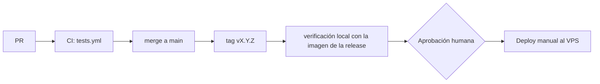

# Despliegue de Dentissa

> Regla innegociable: ningún deploy a producción sin aprobación humana explícita del dueño del
> repositorio.

**Estado actual:** solo existe el entorno local con Docker Compose. Producción en un VPS con la
misma composición Docker está **planificada**; todo lo relativo a producción en este documento es
una propuesta aprobada el 2026-09-23 como plan de despliegue: los `TODO(init)` siguen abiertos y el rollback se valida en el primer ensayo.

## Entornos
| Entorno | URL | Rama / disparador | Aprobación | Datos |
|---|---|---|---|---|
| local | http://localhost:8000 | cualquier rama; `docker compose up -d --build` | ninguna | ficticios |
| staging | — | no existe | — | — |
| prod (planificado) | TODO(init): dominio del VPS | tag `vX.Y.Z` desplegado a mano | **humana (dueño del repo)** | reales (solo tras cerrar el objetivo 1 del roadmap) |

Sin staging, P12 exige que cada release pase la suite completa en CI y una verificación manual en
local con la imagen de la release antes de ir a producción.

## Plataforma e infraestructura
- **Local:** `docker-compose.yml` con `app` (php:8.4-fpm-alpine + Node, `docker/Dockerfile`), `nginx` (8000:80, 443), `db` (postgres:16), `redis` (7-alpine), y observabilidad `loki` + `grafana` (3000) + `alloy` (recoge logs de todos los contenedores).
- **Prod (propuesto):** un VPS con Docker Compose y la misma composición, más:
  - TODO(init): imagen de producción. El `Dockerfile` actual es de desarrollo (monta el código como volumen, no copia código ni compila assets). Hace falta una etapa de build con `composer install --no-dev --optimize-autoloader` y `npm run build`.
  - TODO(init): servicio `worker` con `php artisan queue:work` (los listeners de WhatsApp y Email son `ShouldQueue` y hoy nadie los procesa).
  - TODO(init): terminación TLS (nginx expone 443 sin configuración TLS) y cabeceras de seguridad.
  - TODO(init): credenciales de PostgreSQL tomadas de variables de entorno, no escritas en `docker-compose.yml`; no publicar 5432, 6379, 3100 ni 3000 a Internet.
  - Almacenamiento de imágenes en Cloudflare R2 (externo).
- No hay IaC.

## Pipeline

Texto alternativo: un PR pasa CI, se integra en `main`, se etiqueta, se verifica en local, el dueño
del repo aprueba y se despliega a mano en el VPS.

- `.github/workflows/tests.yml` (push y PR, todas las ramas): PHP 8.4, Node 20, PostgreSQL 16 y Redis 7 como servicios; `composer install`, `npm ci`, `npm run build`, `migrate --env=testing`, `./vendor/bin/pest --parallel`.
- `.ai/ci/ai-dd.yml` (**inactivo**): valida specs con `.ai/bin/aidd.py`, Pint en modo test y las herramientas de seguridad de [security.md](security.md). Se activa moviéndolo a `.github/workflows/` cuando el código pase esas herramientas; hasta entonces se ejecutan en local durante `/implement`, `/review` y `/release`.
- No hay job de despliegue: el despliegue es manual.

## Cómo desplegar
Local:
```bash
docker compose up -d --build
docker compose exec -u root app chown -R www-data:www-data /var/www/html/vendor /var/www/html/node_modules
docker compose exec app composer install     # la primera vez tras la spec 015: vendor/ y node_modules/
docker compose exec app npm install          #   viven en volúmenes con nombre, que empiezan vacíos
docker compose exec app php artisan migrate
docker compose exec app npm run dev          # http://localhost:8000 (vite en 127.0.0.1:5173)
```
El `.env` local debe definir `DB_USERNAME`, `DB_PASSWORD` y `DB_DATABASE` iguales a los del volumen `db-data` local.

Producción (spec 015; lo ejecuta una persona, nunca el agente sin aprobación explícita):

**Modelo.** Producción vive en un **clon aparte**, `/home/deploy/dentissa`, con su propio `.env`
(permisos 600) y `docker-compose.prod.yml` (proyecto `dentissa`, contenedores `dentissa-*`). Usa como
volúmenes externos los datos de la pila manual anterior (`/home/deploy/DentisSystem`, proyecto
`dentissystem`, contenedores `laravel-*`): `DATA_VOLUME_PREFIX=dentissystem` en el `.env` del clon.
Las dos pilas nunca corren a la vez; los scripts detienen una antes de arrancar la otra. La pila
manual no se modifica: solo se detiene (`docker compose stop`) y se vuelve a arrancar.

Scripts de `docker/prod/` (desde el clon): `deploy.sh`, `rollback.sh`, `backup.sh`, `restore.sh`,
`verify.sh` y `compose.sh`. Todo comando de Compose sobre producción pasa por `compose.sh`, que fija
`APP_VERSION` a la versión en servicio (`.deploy/current`). Cada operación queda en
`/home/deploy/deploys.log` (fecha UTC, usuario, acción, versión, resultado).

Primer paso, desde la pila manual (con aprobación explícita):
1. Comprobar, sin configurar: `ufw` con 22, 80 y 443; Cloudflare en SSL Full (strict) y si "Always Use HTTPS" está activo; RAM libre para el build (swap de 2 GB si hace falta).
2. `git clone` del repositorio en `/home/deploy/dentissa` y `git checkout <tag>`. Copiar ahí el `.env` de la pila manual (`chmod 600`) y ajustar `COMPOSE_FILE=docker-compose.prod.yml`, `DATA_VOLUME_PREFIX` y las variables de "Variables de entorno" (prod). `/home/deploy/DentisSystem` no se toca.
3. Certbot a webroot: `mkdir -p /var/www/certbot`; `certbot reconfigure` (o editar `/etc/letsencrypt/renewal/dentissapp.com.conf`) con `authenticator = webroot`, `webroot_path = /var/www/certbot` y `deploy_hook = DENTISSA_DIR=/home/deploy/dentissa /home/deploy/dentissa/docker/prod/compose.sh exec -T nginx nginx -s reload`.
4. `docker/prod/deploy.sh --first <tag>`: backup de la pila manual, `stop` de la pila manual, copia de su `storage/app/public` al volumen `storage-public` (solo si está vacío), build de `dentissa-app:<tag>` y `dentissa-web:<tag>`, `up`, `migrate --force` y `verify.sh --local`.
5. `certbot renew --dry-run` y cron diario del usuario `deploy`: `0 3 * * * /home/deploy/dentissa/docker/prod/backup.sh daily`.
6. Desde fuera del droplet: `docker/prod/verify.sh --remote dentissapp.com --origin <IP del droplet>`.

Despliegues siguientes:
```bash
cd /home/deploy/dentissa
git fetch --tags && git checkout vX.Y.Z
docker/prod/deploy.sh vX.Y.Z      # backup, build, up, migrate, verify; registra el resultado
```

Interruptor de emergencia de la CSP: `CSP_REPORT_ONLY=true` en el `.env` del clon y
`docker/prod/compose.sh up -d app` (recrea el contenedor con la versión en servicio). Se revierte igual.

## Migraciones de base de datos
- Cuándo se aplican: después de levantar la nueva imagen y antes de dar la release por buena; siempre precedidas de un `pg_dump`.
- Patrón: expand → migrate → contract (compatibles con la versión anterior del código, P9).
- Dónde viven: `app/Modules/<Módulo>/Infrastructure/Persistence/Eloquent/Migrations/` (cargadas por `AppServiceProvider`) y `database/migrations/` (tablas técnicas).
- Comando: `php artisan migrate --force`.

## Rollback
Estado: documentado (spec 015); se ensaya en local (T058) y en el droplet (T051, T054) antes del release.

**Volver a la pila manual** (solo mientras exista, es decir, hasta retirarla tras el release):
1. `docker/prod/rollback.sh --to-manual`: detiene la pila de producción (`compose.sh stop`) y hace `docker compose start` en `/home/deploy/DentisSystem`. Arranca con su código, su `.env`, su nginx con TLS y sus dependencias intactas.
2. Comprobar: `curl -I https://dentissapp.com/up` y `/login` responden 200 (el certificado y nginx son los de la pila manual).
3. Datos: la pila manual lee los mismos volúmenes de datos. Las imágenes de datos de producción tienen las mismas versiones que las suyas (Postgres 16, Redis 7, Loki 3.0.0, Grafana 11.0.0), así que lee lo que escribió producción. Los archivos subidos a `storage/app/public` desde producción **no** están en la pila manual (el volumen de producción no se sincroniza de vuelta).
4. Para volver a producción: `docker/prod/deploy.sh --first <tag>` (el volumen `storage-public` ya tiene datos y no se sobrescribe).

**Volver a la versión anterior** (imágenes aún en el droplet; se conservan las dos últimas):
1. `docker/prod/rollback.sh` (a `.deploy/previous`) o `docker/prod/rollback.sh <tag>`: `up -d` con esas imágenes y `verify.sh --local`.
2. Si la release incluía migraciones compatibles hacia atrás (P9), no se toca la base.
3. Si no lo eran: `docker/prod/rollback.sh <tag> --restore /home/deploy/backups/pre-<tag-actual>-*.dump`. Pide confirmación escribiendo `rollback`, detiene `nginx`, `app` y `queue`, restaura con `pg_restore --clean` y arranca la versión anterior. Se pierden las escrituras posteriores al dump.
- Tiempo medido: TODO(init): se mide en el ensayo del droplet (T054); objetivo < 15 min con restauración.
- En código: cada merge a `main` es `--no-ff` y se puede revertir con `git revert -m 1 <merge>` (práctica ya usada en las Unidades 3 y 4).

## Variables de entorno
| Nombre | local | prod | Dónde se configura |
|---|---|---|---|
| APP_NAME, APP_ENV, APP_KEY, APP_DEBUG, APP_URL | ✓ | ✓ | `.env` (prod: `APP_ENV=production`, `APP_DEBUG=false`) |
| DB_CONNECTION, DB_HOST, DB_PORT, DB_DATABASE, DB_USERNAME, DB_PASSWORD | ✓ | ✓ | `.env` |
| REDIS_CLIENT, REDIS_HOST, REDIS_PASSWORD, REDIS_PORT | ✓ | ✓ | `.env` (usar `predis`) |
| QUEUE_CONNECTION, CACHE_STORE, SESSION_* | ✓ | ✓ | `.env` (prod: `SESSION_ENCRYPT=true`, `SESSION_SECURE_COOKIE=true`) |
| SANCTUM_STATEFUL_DOMAINS, SANCTUM_TOKEN_EXPIRATION, SANCTUM_TOKEN_PREFIX | opcional | ✓ | `.env` (no están en `.env.example`) |
| R2_ACCESS_KEY_ID, R2_SECRET_ACCESS_KEY, R2_DEFAULT_REGION, R2_BUCKET, R2_URL, R2_ENDPOINT, R2_USE_PATH_STYLE_ENDPOINT | ✓ | ✓ | `.env` |
| TWILIO_SID, TWILIO_AUTH_TOKEN, TWILIO_PHONE_NUMBER, TWILIO_APPOINTMENT_TEMPLATE_SID | opcional | ✓ | `.env` (no están en `.env.example`) |
| BREVO_EMAIL_SENDER_API_KEY, BREVO_RESET_PASSWORD_TEMPLATE_ID | opcional | ✓ | `.env` (no están en `.env.example`) |
| LOG_CHANNEL, LOG_STACK, LOG_LEVEL | ✓ | ✓ | `.env` (prod: `LOG_LEVEL=info` o superior) |
| GRAFANA_PASSWORD | ✓ | ✓ | `.env` |

(Solo nombres. Nunca valores. En el VPS, `.env` con permisos 600 y fuera de cualquier volumen servido por nginx.)

## Verificación post-deploy
- Health check: `GET /up` (Laravel, `bootstrap/app.php`).
- Smoke tests: login de un administrador, carga de `/agenda`, creación de una cita de prueba y comprobación de que el worker procesa el evento.
- Logs: Alloy → Loki → Grafana (puerto 3000, solo por túnel SSH) recoge el stdout/stderr de los contenedores; los logs de Laravel llegan porque en local se usa `LOG_CHANNEL=stderr` (confirmado por el usuario); `.env.example` todavía declara `stack` → `single`, así que el `.env` del VPS debe usar `stderr`. Métricas y alertas: TODO(init): no existen. Ver [observability.md](observability.md).

## Riesgos conocidos
Formato 1.5.6 (numeración añadida por `/init --upgrade` a 1.6.0, 2026-09-24; contenido sin
cambios; la prioridad de cada riesgo está por asignar: el documento no la indicaba). Estados como en
[security.md](security.md).

### RD1 · Prioridad por asignar — Sin rollback probado ni backups automáticos de PostgreSQL.

Correcciones:
- RD1.a Ensayar el rollback una vez (derivada) — estado: pendiente (roadmap objetivo 4)
- RD1.b Backups automáticos de PostgreSQL (derivada) — estado: pendiente (roadmap objetivo 4)

### RD2 · Prioridad por asignar — `Dockerfile` solo de desarrollo; no hay imagen de producción.

Correcciones:
- RD2.a Imagen de producción (derivada) — estado: pendiente (roadmap objetivo 4)

### RD3 · Prioridad por asignar — Sin worker de colas en `docker-compose.yml`: WhatsApp y el correo de reset no se enviarían.

Correcciones:
- RD3.a Worker de colas en `docker-compose.yml` (derivada) — estado: pendiente (roadmap objetivo 4)

### RD4 · Prioridad por asignar — `env()` fuera de `config/` en Twilio y Brevo: `config:cache` los deja en null.

Correcciones:
- RD4.a Leer Twilio y Brevo con `config('services.*')` en lugar de `env()` (derivada, P8) — estado: pendiente (roadmap, Pendientes y deuda)

### RD5 · Prioridad por asignar — `.env.example` trae `APP_DEBUG=true`, `SESSION_ENCRYPT=false`, `DB_CONNECTION=sqlite` y `REDIS_CLIENT=phpredis` (el Dockerfile no instala phpredis).

Correcciones:
- RD5.a `APP_DEBUG=false` y `SESSION_ENCRYPT=true` en `.env.example` (derivada; = RS10) — estado: pendiente
- RD5.b `DB_CONNECTION=pgsql` y `REDIS_CLIENT=predis` en `.env.example` (derivada) — estado: pendiente (roadmap, Pendientes y deuda)

### RD6 · Prioridad por asignar — `docker-compose.yml` publica PostgreSQL y Redis en el host y escribe credenciales en el archivo.

Correcciones:
- RD6.a No publicar PostgreSQL ni Redis en el host (derivada) — estado: pendiente
- RD6.b Credenciales de `docker-compose.yml` desde `.env` (derivada) — estado: pendiente

### RD7 · Prioridad por asignar — `phpunit.xml` apunta a `DB_HOST=db`: `composer run test` fuera de Docker falla sin override.

Correcciones:
- RD7.a Ejecutar los tests dentro de Docker (documentado en `AGENTS.md`) o un override para el host (derivada) — estado: pendiente

### RD8 · Prioridad por asignar — `Docker.md` usa `docker exec app`, pero el contenedor se llama `laravel-app`; usar `docker compose exec app`.

Correcciones:
- RD8.a Corregir el nombre del contenedor en `Docker.md` (derivada) — estado: pendiente (roadmap, Pendientes y deuda)
