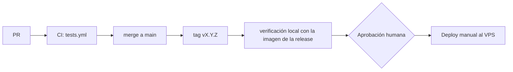

# Despliegue de Dentissa

> Regla innegociable: ningún deploy a producción sin aprobación humana explícita del dueño del
> repositorio.

**Estado actual:** solo existe el entorno local con Docker Compose. Producción en un VPS con la
misma composición Docker está **planificada**; todo lo relativo a producción en este documento es
una propuesta aprobada el 2026-09-23 como plan de despliegue: los `TODO(init)` siguen abiertos y el rollback se valida en el primer ensayo.

## Entornos
| Entorno | URL | Rama / disparador | Aprobación | Datos |
|---|---|---|---|---|
| local | http://localhost:8000 | cualquier rama; `docker compose up -d --build` | ninguna | ficticios |
| staging | — | no existe | — | — |
| prod (planificado) | TODO(init): dominio del VPS | tag `vX.Y.Z` desplegado a mano | **humana (dueño del repo)** | reales (solo tras cerrar el objetivo 1 del roadmap) |

Sin staging, P12 exige que cada release pase la suite completa en CI y una verificación manual en
local con la imagen de la release antes de ir a producción.

## Plataforma e infraestructura
- **Local:** `docker-compose.yml` con `app` (php:8.4-fpm-alpine + Node, `docker/Dockerfile`), `nginx` (8000:80, 443), `db` (postgres:16), `redis` (7-alpine), y observabilidad `loki` + `grafana` (3000) + `alloy` (recoge logs de todos los contenedores).
- **Prod (propuesto):** un VPS con Docker Compose y la misma composición, más:
  - TODO(init): imagen de producción. El `Dockerfile` actual es de desarrollo (monta el código como volumen, no copia código ni compila assets). Hace falta una etapa de build con `composer install --no-dev --optimize-autoloader` y `npm run build`.
  - TODO(init): servicio `worker` con `php artisan queue:work` (los listeners de WhatsApp y Email son `ShouldQueue` y hoy nadie los procesa).
  - TODO(init): terminación TLS (nginx expone 443 sin configuración TLS) y cabeceras de seguridad.
  - TODO(init): credenciales de PostgreSQL tomadas de variables de entorno, no escritas en `docker-compose.yml`; no publicar 5432, 6379, 3100 ni 3000 a Internet.
  - Almacenamiento de imágenes en Cloudflare R2 (externo).
- No hay IaC.

## Pipeline

Texto alternativo: un PR pasa CI, se integra en `main`, se etiqueta, se verifica en local, el dueño
del repo aprueba y se despliega a mano en el VPS.

- `.github/workflows/tests.yml` (push y PR, todas las ramas): PHP 8.4, Node 20, PostgreSQL 16 y Redis 7 como servicios; `composer install`, `npm ci`, `npm run build`, `migrate --env=testing`, `./vendor/bin/pest --parallel`.
- `.ai/ci/ai-dd.yml` (**inactivo**): valida specs con `.ai/bin/aidd.py`, Pint en modo test y las herramientas de seguridad de [security.md](security.md). Se activa moviéndolo a `.github/workflows/` cuando el código pase esas herramientas; hasta entonces se ejecutan en local durante `/implement`, `/review` y `/release`.
- No hay job de despliegue: el despliegue es manual.

## Cómo desplegar
Local:
```bash
docker compose up -d --build
docker compose exec -u root app chown -R www-data:www-data /var/www/html
docker compose exec app composer install
docker compose exec app npm install
docker compose exec app php artisan migrate
docker compose exec app npm run dev          # http://localhost:8000
```

Producción (propuesto, sin probar; lo ejecuta una persona, nunca el agente sin aprobación):
```bash
# En el VPS, con aprobación explícita
cd /srv/dentissa
git fetch --tags && git checkout vX.Y.Z
docker compose exec db pg_dump -U "$DB_USERNAME" -Fc "$DB_DATABASE" > backups/pre-vX.Y.Z.dump
docker compose up -d --build
docker compose exec app php artisan migrate --force
docker compose exec app php artisan config:cache && docker compose exec app php artisan route:cache
docker compose restart worker
curl -fsS https://TODO-dominio/up
```

## Migraciones de base de datos
- Cuándo se aplican: después de levantar la nueva imagen y antes de dar la release por buena; siempre precedidas de un `pg_dump`.
- Patrón: expand → migrate → contract (compatibles con la versión anterior del código, P9).
- Dónde viven: `app/Modules/<Módulo>/Infrastructure/Persistence/Eloquent/Migrations/` (cargadas por `AppServiceProvider`) y `database/migrations/` (tablas técnicas).
- Comando: `php artisan migrate --force`.

## Rollback
**Estado: propuesto y sin probar — es el mayor riesgo de este documento.**
1. Volver al tag anterior: `git checkout vX.Y.(Z-1)` y `docker compose up -d --build`.
2. Si la release incluía migraciones compatibles hacia atrás (P9), no se toca la base.
3. Si no lo eran: `php artisan migrate:rollback --step=<n>`; si el `down()` falla o hubo pérdida de datos, restaurar `pg_restore -c -d "$DB_DATABASE" backups/pre-vX.Y.Z.dump` (se pierden las escrituras posteriores al dump).
4. `php artisan config:cache`, reiniciar `worker` y comprobar `/up`.
- Tiempo estimado: TODO(init): medir en el primer ensayo.
- En código: cada merge a `main` es `--no-ff` y se puede revertir con `git revert -m 1 <merge>` (práctica ya usada en las Unidades 3 y 4).

## Variables de entorno
| Nombre | local | prod | Dónde se configura |
|---|---|---|---|
| APP_NAME, APP_ENV, APP_KEY, APP_DEBUG, APP_URL | ✓ | ✓ | `.env` (prod: `APP_ENV=production`, `APP_DEBUG=false`) |
| DB_CONNECTION, DB_HOST, DB_PORT, DB_DATABASE, DB_USERNAME, DB_PASSWORD | ✓ | ✓ | `.env` |
| REDIS_CLIENT, REDIS_HOST, REDIS_PASSWORD, REDIS_PORT | ✓ | ✓ | `.env` (usar `predis`) |
| QUEUE_CONNECTION, CACHE_STORE, SESSION_* | ✓ | ✓ | `.env` (prod: `SESSION_ENCRYPT=true`, `SESSION_SECURE_COOKIE=true`) |
| SANCTUM_STATEFUL_DOMAINS, SANCTUM_TOKEN_EXPIRATION, SANCTUM_TOKEN_PREFIX | opcional | ✓ | `.env` (no están en `.env.example`) |
| R2_ACCESS_KEY_ID, R2_SECRET_ACCESS_KEY, R2_DEFAULT_REGION, R2_BUCKET, R2_URL, R2_ENDPOINT, R2_USE_PATH_STYLE_ENDPOINT | ✓ | ✓ | `.env` |
| TWILIO_SID, TWILIO_AUTH_TOKEN, TWILIO_PHONE_NUMBER, TWILIO_APPOINTMENT_TEMPLATE_SID | opcional | ✓ | `.env` (no están en `.env.example`) |
| BREVO_EMAIL_SENDER_API_KEY, BREVO_RESET_PASSWORD_TEMPLATE_ID | opcional | ✓ | `.env` (no están en `.env.example`) |
| LOG_CHANNEL, LOG_STACK, LOG_LEVEL | ✓ | ✓ | `.env` (prod: `LOG_LEVEL=info` o superior) |
| GRAFANA_PASSWORD | ✓ | ✓ | `.env` |

(Solo nombres. Nunca valores. En el VPS, `.env` con permisos 600 y fuera de cualquier volumen servido por nginx.)

## Verificación post-deploy
- Health check: `GET /up` (Laravel, `bootstrap/app.php`).
- Smoke tests: login de un administrador, carga de `/agenda`, creación de una cita de prueba y comprobación de que el worker procesa el evento.
- Logs: Alloy → Loki → Grafana (puerto 3000, solo por túnel SSH) recoge el stdout/stderr de los contenedores; los logs de Laravel llegan porque en local se usa `LOG_CHANNEL=stderr` (confirmado por el usuario); `.env.example` todavía declara `stack` → `single`, así que el `.env` del VPS debe usar `stderr`. Métricas y alertas: TODO(init): no existen. Ver [observability.md](observability.md).

## Riesgos conocidos
- **Sin rollback probado** ni backups automáticos de PostgreSQL.
- `Dockerfile` solo de desarrollo; no hay imagen de producción.
- Sin worker de colas en `docker-compose.yml`: WhatsApp y el correo de reset no se enviarían.
- `env()` fuera de `config/` en Twilio y Brevo: `config:cache` los deja en null.
- `.env.example` trae `APP_DEBUG=true`, `SESSION_ENCRYPT=false`, `DB_CONNECTION=sqlite` y `REDIS_CLIENT=phpredis` (el Dockerfile no instala phpredis).
- `docker-compose.yml` publica PostgreSQL y Redis en el host y escribe credenciales en el archivo.
- `phpunit.xml` apunta a `DB_HOST=db`: `composer run test` fuera de Docker falla sin override.
- `Docker.md` usa `docker exec app`, pero el contenedor se llama `laravel-app`; usar `docker compose exec app`.
