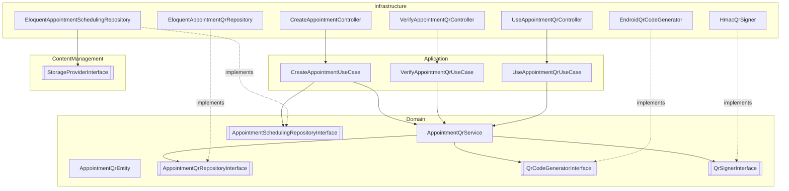
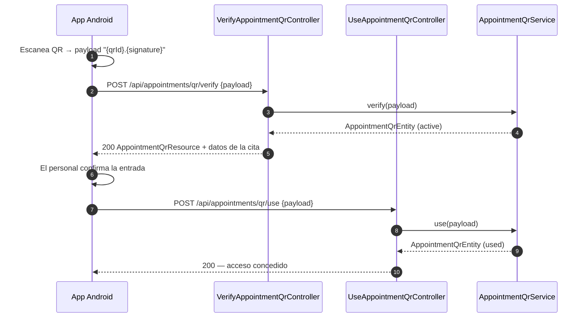
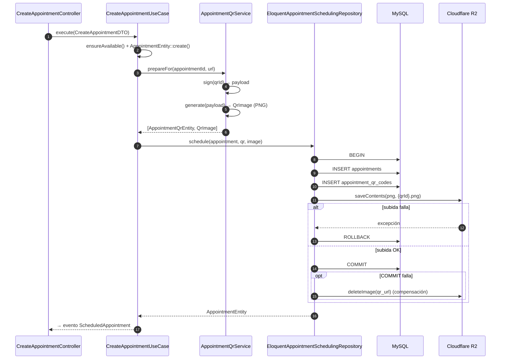
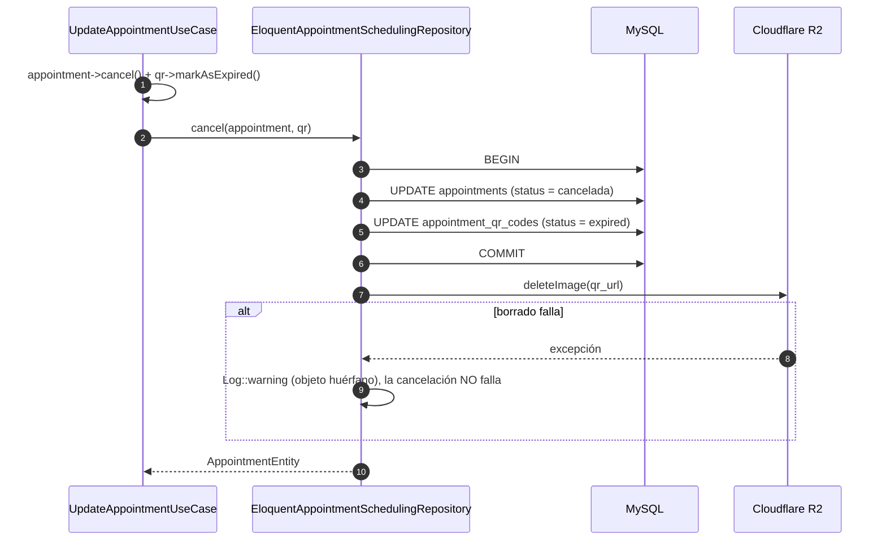

# Feature: Generación de códigos QR por cita (App Android)

| Campo | Valor |
|---|---|
| Módulo afectado | `App\Modules\Appointments` |
| Módulos colaboradores | `ContentManagement` (almacenamiento R2) |
| Consumidor | App Android (escaneo, verificación y registro de entrada) |
| Estado | Diseño aprobado — decisiones cerradas (ver §10) |
| Stack | PHP 8.4 · Laravel 12 · Eloquent · Cloudflare R2 (disco `s3`) · Pest |

---

## 1. Objetivo

Generar un código QR **único y firmado** por cada cita creada, persistir su registro en base de datos y almacenar la imagen en Cloudflare R2, de forma que la app de Android pueda escanearlo y el backend validar su autenticidad y vigencia.

La generación ocurre **dentro del flujo de creación de citas** y es **atómica**: si falla cualquier paso (cita, registro QR o subida a R2), no queda ningún dato parcial.

### 1.1 Alcance

**Incluido**
- Generación de QR al crear una cita.
- Persistencia del registro QR (tabla `appointment_qr_codes`).
- Almacenamiento de la imagen en R2 mediante `StorageProvider`.
- Firma HMAC del contenido del QR con clave dedicada `QR_SIGNING_KEY`.
- Endpoint de verificación (firma + estado) y endpoint de uso (`active → used`) para el acceso a la cita.
- Endpoint de consulta del QR de una cita (`AppointmentQrResource`) para la app Android.
- Regeneración del QR al reprogramar una cita.
- Limpieza del QR (BD + R2) al eliminar una cita.

**Fuera de alcance**
- Lógica de escaneo en Android (cliente).
- Expiración automática de QR por tiempo (*cron job* / columna `expires_at`). Ver §10.2.
- Envío del QR al paciente por WhatsApp/Email (extensión futura vía `ScheduledAppointment`).

---

## 2. Contexto: estructura actual del módulo `Appointments`

El módulo sigue DDD en tres capas. La feature se integra **respetando los namespaces existentes**, incluyendo la carpeta `Aplication` (sic), para no romper la consistencia del autoload PSR-4.

```
app/Modules/Appointments/
├── Aplication/
│   ├── DTOs/                 → CreateAppointmentDTO, UpdateAppointmentDTO, ...
│   ├── Exceptions/           → AppointmentAplicationExceptions, ...
│   └── UseCases/             → CreateAppointmentUseCase, RetriveDataForScheduledAppointmenEventUseCase, ...
├── Domain/
│   ├── Entities/             → AppointmentEntity, TreatmentEntity
│   ├── Events/               → ScheduledAppointment
│   ├── Exceptions/           → AppointmentException, ValueObjects/*
│   ├── Repositories/         → AppointmentsRepositoryInterface (contratos)
│   ├── Service/              → AppointmentsService, ScheduleAvailabilityChecker
│   └── ValueObjects/         → AppointmentId (UuidIdentifier), AppointmentStatus, ...
└── Infrastructure/
    ├── Http/Controllers/     → CreateAppointmentController (invokable), ...
    ├── Http/Resources/       → AppointmentResource
    └── Persistence/Eloquent/
        ├── Migrations/       → autocargadas por AppServiceProvider (glob)
        ├── Models/           → AppointmentModel
        └── EloquentAppointmentRepository.php
```

**Convenciones observadas que esta feature adopta:**

| Convención | Ejemplo existente |
|---|---|
| Contratos de repositorio en `Domain/Repositories` | `AppointmentsRepositoryInterface` |
| Servicios de dominio envuelven al repositorio | `AppointmentsService` |
| IDs como VO que extienden `App\Core\Domain\UuidIdentifier` | `AppointmentId::random()` |
| Entidades con `create()` y `fromPrimitives()` | `AppointmentEntity` |
| Use cases `final readonly` con `execute(DTO)` | `CreateAppointmentUseCase` |
| Controladores invocables `final readonly` | `CreateAppointmentController` |
| Excepciones con *named constructors* | `AppointmentException::notFound()` |
| Escrituras multi-tabla atómicas en un repositorio dedicado con `DB::transaction` | `EloquentAppointmentCompletionRepository` (AppointmentTracking) |
| Bindings interfaz → implementación en `AppServiceProvider` | `bind(AppointmentsRepositoryInterface, EloquentAppointmentRepository)` |
| `StorageProvider` inyectado por *contextual binding* | `when(SaveGalleryImageUseCase)->needs(StorageProviderInterface)` |

---

## 3. Arquitectura propuesta

### 3.1 Árbol de archivos nuevos / modificados

```
app/Modules/Appointments/
├── Aplication/
│   ├── DTOs/
│   │   ├── VerifyAppointmentQrDTO.php                         [NUEVO]
│   │   ├── UseAppointmentQrDTO.php                            [NUEVO]
│   │   └── GetAppointmentQrByAppointmentIdDTO.php             [NUEVO]
│   ├── Exceptions/
│   │   └── AppointmentQrAplicationException.php               [NUEVO]
│   └── UseCases/
│       ├── CreateAppointmentUseCase.php                        [MODIFICADO]
│       ├── UpdateAppointmentUseCase.php                        [MODIFICADO]
│       ├── DeleteAppointmentUseCase.php                        [MODIFICADO]
│       ├── RegenerateAppointmentQrUseCase.php                  [NUEVO]
│       ├── VerifyAppointmentQrUseCase.php                      [NUEVO]
│       ├── UseAppointmentQrUseCase.php                         [NUEVO]
│       └── GetAppointmentQrByAppointmentIdUseCase.php          [NUEVO]
├── Domain/
│   ├── Contracts/
│   │   ├── QrCodeGeneratorInterface.php                        [NUEVO]
│   │   └── QrSignerInterface.php                               [NUEVO]
│   ├── Entities/
│   │   └── AppointmentQrEntity.php                             [NUEVO]
│   ├── Exceptions/
│   │   ├── AppointmentQrException.php                          [NUEVO]
│   │   └── ValueObjects/AppointmentQrStatusException.php       [NUEVO]
│   ├── Repositories/
│   │   ├── AppointmentQrRepositoryInterface.php                [NUEVO]
│   │   └── AppointmentSchedulingRepositoryInterface.php        [NUEVO]
│   ├── Service/
│   │   └── AppointmentQrService.php                            [NUEVO]
│   └── ValueObjects/
│       ├── AppointmentQrId.php                                 [NUEVO]
│       ├── AppointmentQrStatus.php                             [NUEVO]
│       └── AppointmentQrUrl.php                                [NUEVO]
└── Infrastructure/
    ├── Http/
    │   ├── Controllers/
    │   │   ├── VerifyAppointmentQrController.php               [NUEVO]
    │   │   ├── UseAppointmentQrController.php                  [NUEVO]
    │   │   └── GetAppointmentQrByAppointmentIdController.php   [NUEVO]
    │   └── Resources/AppointmentQrResource.php                 [NUEVO]
    ├── Qr/
    │   ├── EndroidQrCodeGenerator.php                          [NUEVO]
    │   └── HmacQrSigner.php                                    [NUEVO]
    └── Persistence/Eloquent/
        ├── Migrations/
        │   └── 2026_09_22_000000_create_appointment_qr_codes_table.php [NUEVO]
        ├── Models/AppointmentQrModel.php                       [NUEVO]
        ├── EloquentAppointmentQrRepository.php                 [NUEVO]
        └── EloquentAppointmentSchedulingRepository.php         [NUEVO]

app/Modules/ContentManagement/
├── StorageProviderInterface.php                                [MODIFICADO]
└── StorageProvider.php                                         [MODIFICADO]

app/Providers/AppServiceProvider.php                            [MODIFICADO]
config/services.php                                             [MODIFICADO] (clave qr.signing_key)
.env.example                                                    [MODIFICADO] (QR_SIGNING_KEY)
routes/api.php                                                  [MODIFICADO]
composer.json                                                   [MODIFICADO] (librería QR)
tests/Modules/Appointments/Integration/AppointmentQrTest.php    [NUEVO]
```

### 3.2 Diagrama de dependencias por capa



La regla de dependencia se mantiene: **Domain no depende de Infrastructure**. Generación, firma y almacenamiento se abstraen como puertos (interfaces).

---

## 4. Capa de Dominio

**Namespace base:** `App\Modules\Appointments\Domain`

### 4.1 Value Objects

| Clase | Namespace | Descripción |
|---|---|---|
| `AppointmentQrId` | `...\Domain\ValueObjects` | `final readonly`, extiende `App\Core\Domain\UuidIdentifier`. |
| `AppointmentQrStatus` | `...\Domain\ValueObjects` | Valores `active`, `used`, `expired`. Named constructors `active()`, `used()`, `expired()`; predicados `isActive()`, etc. Lanza `AppointmentQrStatusException`. |
| `AppointmentQrUrl` | `...\Domain\ValueObjects` | URL pública de la imagen en R2. Valida formato URL no vacío. |

### 4.2 Entidad `AppointmentQrEntity`

```php
namespace App\Modules\Appointments\Domain\Entities;

final class AppointmentQrEntity
{
    private function __construct(
        private readonly AppointmentQrId $id,
        private readonly AppointmentId $appointmentId,
        private readonly AppointmentQrUrl $qrUrl,
        private AppointmentQrStatus $status,
        private readonly DateTimeImmutable $createdAt,
        private DateTimeImmutable $updatedAt,
    ) {}

    public static function create(AppointmentQrId $id, AppointmentId $appointmentId, AppointmentQrUrl $qrUrl): self;
    public static function fromPrimitives(string $id, string $appointmentId, string $qrUrl, string $status, string $createdAt, string $updatedAt): self;

    public function markAsUsed(): void;     // active → used; lanza excepción si no está activo
    public function markAsExpired(): void;  // active → expired (solo por cancelación de la cita en esta feature)
    public function ensureIsUsable(): void; // lanza AppointmentQrException::alreadyUsed()/expired()
}
```

**Reglas de negocio (invariantes)**
- Una cita tiene **como máximo un QR** registrado.
- El **contenido** del QR es inmutable. Ante un cambio de la cita que lo invalide, el QR se **elimina y se regenera** (no se edita).
- El **estado** sí puede transicionar: `active → used` y `active → expired`. Ninguna otra transición es válida.
- `used` lo asigna el endpoint de uso invocado por la app Android al dar acceso a la cita.
- `expired` en esta feature solo se asigna al **cancelar** la cita. La expiración automática por tiempo queda fuera de alcance (§10.2), aunque el estado ya existe en el enum para soportarla.
- Un QR `expired` **no tiene imagen en R2**: se borra al cancelar la cita para no ocupar almacenamiento. El registro en BD se conserva como historial.

### 4.3 Contratos (puertos)

#### `AppointmentQrRepositoryInterface`
`App\Modules\Appointments\Domain\Repositories`

```php
interface AppointmentQrRepositoryInterface
{
    public function save(AppointmentQrEntity $qr): AppointmentQrEntity;
    public function findById(AppointmentQrId $id): ?AppointmentQrEntity;
    public function findByAppointmentId(AppointmentId $appointmentId): ?AppointmentQrEntity;
    public function deleteByAppointmentId(AppointmentId $appointmentId): void;
}
```

| Método del borrador original | Método final | Motivo |
|---|---|---|
| `createQR($citaId, $qrUrl)` | `save(AppointmentQrEntity)` | Consistente con `AppointmentsRepositoryInterface::save`; recibe entidad, no primitivos. También persiste cambios de estado. |
| `getQRByCitaId($citaId)` | `findByAppointmentId(AppointmentId)` | Convención `findBy*` y VO tipado. |
| `deleteQR($citaId)` | `deleteByAppointmentId(AppointmentId)` | Nombre explícito sobre la clave de búsqueda. |
| — | `findById(AppointmentQrId)` | Necesario para la validación desde el QR escaneado. |

#### `AppointmentSchedulingRepositoryInterface`
`App\Modules\Appointments\Domain\Repositories`

Repositorio de escritura atómica, análogo a `AppointmentCompletionRepositoryInterface` de `AppointmentTracking`.

```php
interface AppointmentSchedulingRepositoryInterface
{
    /**
     * Persiste en una única operación atómica la cita, su registro QR
     * y la imagen del QR en el almacenamiento externo.
     * Si cualquier paso falla, no queda estado parcial.
     */
    public function schedule(
        AppointmentEntity $appointment,
        AppointmentQrEntity $qr,
        QrImage $image,
    ): AppointmentEntity;

    /**
     * Persiste atómicamente la cita cancelada y su QR expirado.
     * Tras el COMMIT elimina la imagen del QR en el almacenamiento externo.
     * Ambas entidades deben venir ya transicionadas en memoria
     * (AppointmentEntity::cancel() y AppointmentQrEntity::markAsExpired()).
     */
    public function cancel(
        AppointmentEntity $appointment,
        AppointmentQrEntity $qr,
    ): AppointmentEntity;
}
```

#### `QrCodeGeneratorInterface`
`App\Modules\Appointments\Domain\Contracts`

```php
interface QrCodeGeneratorInterface
{
    /** Devuelve la imagen PNG (binario) que codifica el payload. */
    public function generate(string $payload): QrImage;
}
```

`QrImage` es un VO simple (`contents`, `mimeType`, `extension`) para no acoplar el dominio a la librería.

#### `QrSignerInterface`
`App\Modules\Appointments\Domain\Contracts`

```php
interface QrSignerInterface
{
    /** Construye el token firmado que se codifica en el QR: "{qrId}.{signature}". */
    public function sign(AppointmentQrId $qrId): string;

    /** Verifica la firma y devuelve el id del QR, o lanza AppointmentQrException::invalidSignature(). */
    public function verify(string $payload): AppointmentQrId;
}
```

El formato y algoritmo de firma se detallan en §8.1.

### 4.4 Servicio de dominio `AppointmentQrService`

`App\Modules\Appointments\Domain\Service\AppointmentQrService`

Orquesta generación y consulta; no conoce Eloquent ni R2.

```php
final class AppointmentQrService
{
    public function __construct(
        private readonly AppointmentQrRepositoryInterface $repository,
        private readonly QrCodeGeneratorInterface $generator,
        private readonly QrSignerInterface $signer,
    ) {}

    /** Prepara (sin persistir) la entidad QR y su imagen para una cita. */
    public function prepareFor(AppointmentQrId $qrId, AppointmentId $appointmentId, AppointmentQrUrl $targetUrl): array; // [AppointmentQrEntity, QrImage]

    public function findByAppointmentId(AppointmentId $id): ?AppointmentQrEntity;

    /** Valida firma + existencia + estado `active`. Sin efectos secundarios. */
    public function verify(string $payload): AppointmentQrEntity;

    /** verify() + markAsUsed() + save(). */
    public function use(string $payload): AppointmentQrEntity;

    public function deleteByAppointmentId(AppointmentId $id): void;
}
```

### 4.5 Excepciones de dominio

`App\Modules\Appointments\Domain\Exceptions\AppointmentQrException`

| Named constructor | Situación | HTTP sugerido |
|---|---|---|
| `notFound()` | No existe QR para la cita/id | 404 |
| `invalidSignature()` | Firma alterada o inválida | 403 |
| `alreadyUsed()` | QR con estado `used` | 409 |
| `expired()` | QR con estado `expired` | 410 |
| `invalidStatusTransition()` | Transición de estado no permitida | 409 |

Un payload mal formado (sin separador o con un id que no es UUID) lanza `InvalidArgumentException` desde `UuidIdentifier`. Los controladores ya la mapean a 400, igual que `CreateAppointmentController`.

---

## 5. Capa de Aplicación

**Namespace base:** `App\Modules\Appointments\Aplication`

### 5.1 `CreateAppointmentUseCase` (modificado)

Pasa de llamar a `AppointmentsService::saveAppointment()` a delegar en el repositorio atómico:

```php
public function execute(CreateAppointmentDTO $dto): AppointmentEntity
{
    // ... construcción de VOs y ensureAvailable() sin cambios

    $appointment = AppointmentEntity::create(...);

    $qrId = AppointmentQrId::random();

    [$qr, $image] = $this->qrService->prepareFor(
        $qrId,
        $appointment->Id(),
        new AppointmentQrUrl($this->storage->urlFor($qrId->value.'.png')), // ruta determinista en R2
    );

    return $this->schedulingRepository->schedule($appointment, $qr, $image);
}
```

`RetriveDataForScheduledAppointmenEventUseCase` y `CreateAppointmentController` **no cambian**: el evento `ScheduledAppointment` se sigue disparando después de que la transacción ya se confirmó.

### 5.2 `UpdateAppointmentUseCase` (modificado)

| Cambio en la cita | Acción sobre el QR |
|---|---|
| Reprogramación (fecha u hora) | `RegenerateAppointmentQrUseCase`: elimina registro + objeto R2, genera y persiste uno nuevo. |
| Estado → `cancelada` | `markAsExpired()` + **eliminación de la imagen en R2**, vía `AppointmentSchedulingRepositoryInterface::cancel()` (§7.2). |
| Estado → `completada` / recordatorio de WhatsApp | Sin cambios en el QR. |

En la cancelación, `UpdateAppointmentUseCase` deja de llamar a `AppointmentsService::saveAppointment()` y delega en `cancel()`, para que la cita y el QR se guarden en la misma transacción. Si la cita no tiene QR (citas creadas antes de esta feature), se guarda solo la cita como hasta ahora.

### 5.3 `DeleteAppointmentUseCase` (modificado)

La FK `ON DELETE CASCADE` elimina el registro en BD, pero **no** el objeto en R2. El use case debe borrar primero la imagen con `StorageProviderInterface::deleteImage()` para evitar objetos huérfanos.

### 5.4 Flujo de escaneo en la app Android

El consumo del QR se divide en dos casos de uso para que la verificación no tenga efectos secundarios:

| Use case | DTO | Acción | Efecto |
|---|---|---|---|
| `VerifyAppointmentQrUseCase` | `VerifyAppointmentQrDTO(payload)` | Verifica firma HMAC, existencia y estado `active`. Devuelve los datos de la cita para mostrarlos en Android. | Ninguno (solo lectura) |
| `UseAppointmentQrUseCase` | `UseAppointmentQrDTO(payload)` | Repite la verificación y ejecuta `markAsUsed()`. Es la acción con la que Android da acceso de entrada a la cita. | `active → used` |

`UseAppointmentQrUseCase` vuelve a verificar la firma en lugar de confiar en la llamada previa, porque son dos peticiones independientes. Una segunda llamada sobre el mismo QR devuelve `AppointmentQrException::alreadyUsed()` (409), lo que impide registrar dos veces la entrada.



### 5.5 `GetAppointmentQrByAppointmentIdUseCase` (nuevo)

Devuelve el QR de una cita (`AppointmentQrResource`) para que la app Android muestre la imagen. Es el único canal de entrega del QR en esta feature (ver §10.6).

---

## 6. Capa de Infraestructura

**Namespace base:** `App\Modules\Appointments\Infrastructure`

### 6.1 Migración

`Infrastructure/Persistence/Eloquent/Migrations/2026_09_22_000000_create_appointment_qr_codes_table.php` (se autocarga vía el `glob` de `AppServiceProvider`).

```php
Schema::create('appointment_qr_codes', function (Blueprint $table) {
    $table->uuid('id')->primary();
    $table->foreignUuid('appointment_id')
          ->unique()
          ->constrained('appointments')
          ->cascadeOnDelete()
          ->cascadeOnUpdate();
    $table->string('qr_url')->unique();
    $table->enum('status', ['active', 'used', 'expired'])->default('active');
    $table->timestamps();
});
```

| Columna | Tipo | Restricciones | Nota |
|---|---|---|---|
| `id` | uuid | PK | `AppointmentQrId` |
| `appointment_id` | uuid | FK → `appointments.id`, **unique**, cascade | Se renombra `cita_id` para seguir la convención en inglés del esquema. `appointments.id` ya es UUID (migración `2026_04_23_161754`). |
| `qr_url` | string | unique | URL pública del PNG en R2 |
| `status` | enum | `active` \| `used` \| `expired`, default `active` | |
| `created_at` / `updated_at` | timestamp | | Se añade `updated_at` porque el estado sí cambia. |

### 6.2 Modelo `AppointmentQrModel`

`...\Infrastructure\Persistence\Eloquent\Models\AppointmentQrModel` — `final`, `$incrementing = false`, `$keyType = 'string'`, relación `belongsTo(AppointmentModel::class)`. Se añade `hasOne(AppointmentQrModel::class, 'appointment_id')` en `AppointmentModel`.

### 6.3 Repositorios

- **`EloquentAppointmentQrRepository`** implementa `AppointmentQrRepositoryInterface` con `updateOrCreate` + `mapToDomain()`, igual que `EloquentAppointmentRepository`.
- **`EloquentAppointmentSchedulingRepository`** implementa `AppointmentSchedulingRepositoryInterface`. Ver flujo transaccional en §7.

### 6.4 Adaptadores de QR

| Clase | Implementa | Detalle |
|---|---|---|
| `Infrastructure\Qr\EndroidQrCodeGenerator` | `QrCodeGeneratorInterface` | Genera PNG en memoria. |
| `Infrastructure\Qr\HmacQrSigner` | `QrSignerInterface` | HMAC-SHA256 con `config('services.qr.signing_key')` (`QR_SIGNING_KEY`), independiente de `APP_KEY`. Detalle en §8.1. |

> **Librería:** ZXing y QRGen son librerías **Java**; aplican al lado Android (escaneo), no al backend PHP. Para Laravel se propone **`endroid/qr-code`** (alternativa: `chillerlan/php-qrcode`). Requiere la extensión GD, ya utilizada por `intervention/image`.

### 6.5 Cambio en `ContentManagement\StorageProvider`

`saveImage(UploadedFile $image)` solo acepta archivos subidos por HTTP y genera un nombre aleatorio. El QR se genera en memoria y su ruta debe conocerse antes de persistir, por lo que se añade al contrato:

```php
// StorageProviderInterface
public function saveContents(string $contents, string $filename, string $mimeType): string; // devuelve URL
public function urlFor(string $filename): string;
```

Implementación con `Storage::disk('s3')->put($directory.'/'.$filename, $contents, ['ContentType' => $mimeType])`, reutilizando `verifyImageExtension()`.

**Ruta en R2:** `uploads/appointments/qr/{appointmentQrId}.png`

### 6.6 HTTP

**Rutas nuevas** (`routes/api.php`, dentro del grupo `auth:sanctum` → `prefix('appointments')`). Las rutas `qr/*` se declaran **antes** de `/{id}` para que no las capture el parámetro:

```php
Route::post('/qr/verify', VerifyAppointmentQrController::class);
Route::post('/qr/use', UseAppointmentQrController::class);
Route::get('/{id}/qr', GetAppointmentQrByAppointmentIdController::class);
```

| Método | Ruta | Body | Éxito | Errores |
|---|---|---|---|---|
| `POST` | `/api/appointments/qr/verify` | `{ "payload": "{qrId}.{signature}" }` | 200 `AppointmentQrResource` + datos de la cita | 400 payload mal formado · 403 firma inválida · 404 · 409 `used` · 410 `expired` |
| `POST` | `/api/appointments/qr/use` | `{ "payload": "{qrId}.{signature}" }` | 200 `AppointmentQrResource` (`status: used`) | Igual que verify |
| `GET` | `/api/appointments/{id}/qr` | — | 200 `AppointmentQrResource` | 404 |

Se usa `POST` en la verificación para que el payload firmado no quede registrado en los logs de acceso como parte de la URL.

**`AppointmentQrResource`:** `id`, `appointment_id`, `status`, `qr_url`, `created_at`. Cuando `status = expired` devuelve `qr_url: null`, porque la imagen ya no existe en R2. `AppointmentResource` no se modifica.

### 6.7 Registro en `AppServiceProvider`

```php
$this->app->bind(AppointmentQrRepositoryInterface::class, EloquentAppointmentQrRepository::class);
$this->app->bind(AppointmentSchedulingRepositoryInterface::class, EloquentAppointmentSchedulingRepository::class);
$this->app->bind(QrCodeGeneratorInterface::class, EndroidQrCodeGenerator::class);
$this->app->bind(QrSignerInterface::class, fn () => new HmacQrSigner(
    (string) config('services.qr.signing_key'),
));

$this->app->when([
        CreateAppointmentUseCase::class,
        EloquentAppointmentSchedulingRepository::class,
        DeleteAppointmentUseCase::class,
        RegenerateAppointmentQrUseCase::class,
    ])
    ->needs(StorageProviderInterface::class)
    ->give(fn () => StorageProvider::new('qr', 'uploads/appointments'));
```

### 6.8 Configuración

```php
// config/services.php
'qr' => [
    'signing_key' => env('QR_SIGNING_KEY'),
],
```

```dotenv
# .env.example
QR_SIGNING_KEY=
```

Generar la clave con `php -r "echo base64_encode(random_bytes(32));"`. Si la clave está vacía, `HmacQrSigner` lanza una excepción en el constructor para detectarlo al arrancar y no al primer escaneo.

---

## 7. Flujos transaccionales

### 7.1 Creación de cita

R2 no participa en la transacción de base de datos, así que la atomicidad se garantiza con **orden de operaciones + compensación**:

1. La ruta de la imagen es **determinista** (`{qrId}.png`), por lo que `qr_url` se conoce antes de subir.
2. Dentro de `DB::transaction` se insertan cita y QR, y la **subida a R2 es el último paso**. Si falla, la excepción revierte la transacción.
3. Si la subida fue exitosa pero el `COMMIT` falla, se elimina el objeto de R2 (compensación).



Esqueleto de implementación:

```php
public function schedule(AppointmentEntity $appointment, AppointmentQrEntity $qr, QrImage $image): AppointmentEntity
{
    $uploaded = false;

    try {
        return DB::transaction(function () use ($appointment, $qr, $image, &$uploaded) {
            // 1. La cita primero: el QR depende de su FK.
            $saved = $this->appointments->save($appointment);

            // 2. Registro del QR.
            $this->qrCodes->save($qr);

            // 3. Último paso: subida a R2. Si lanza, la transacción se revierte.
            $this->storage->saveContents($image->contents, $qr->Id()->value.'.png', $image->mimeType);
            $uploaded = true;

            return $saved;
        });
    } catch (Throwable $e) {
        if ($uploaded) {
            $this->storage->deleteImage($qr->QrUrl()->value); // compensación
        }
        throw AppointmentQrAplicationException::schedulingFailed($e);
    }
}
```

### 7.2 Cancelación de cita

Al cancelar, el QR pasa a `expired` y su imagen se elimina de R2. El orden es el **inverso** al de la creación: primero se confirma la BD y **después** se borra en R2.

- Si se borrara la imagen dentro de la transacción y luego fallara el `COMMIT`, la cita quedaría sin cancelar pero con su QR `active` apuntando a una imagen inexistente, y el borrado en R2 no se puede revertir.
- Borrando tras el `COMMIT`, el peor caso es un objeto huérfano en R2, que no afecta a la consistencia de los datos y se puede limpiar.



```php
public function cancel(AppointmentEntity $appointment, AppointmentQrEntity $qr): AppointmentEntity
{
    $saved = DB::transaction(function () use ($appointment, $qr) {
        $saved = $this->appointments->save($appointment);
        $this->qrCodes->save($qr);

        return $saved;
    });

    // Fuera de la transacción: un fallo de R2 no debe impedir la cancelación.
    try {
        $this->storage->deleteImage($qr->QrUrl()->value);
    } catch (Throwable $e) {
        Log::warning('AppointmentScheduling: no se pudo eliminar el QR de R2', [
            'appointmentId' => $appointment->Id()->value,
            'qrId' => $qr->Id()->value,
            'qrUrl' => $qr->QrUrl()->value,
            'error' => $e->getMessage(),
        ]);
    }

    return $saved;
}
```

El `Log::warning` incluye `qrUrl`, de modo que los objetos huérfanos se pueden localizar y borrar. Una limpieza automática (job que borre imágenes de QR `expired`) queda como trabajo futuro (§10.1).

---

## 8. Seguridad y validación

### 8.1 Firma del QR

**Formato del payload codificado en el QR:**

```
{qrId}.{signature}
signature = base64url( HMAC-SHA256( qrId, QR_SIGNING_KEY ) )
```

```php
final readonly class HmacQrSigner implements QrSignerInterface
{
    public function __construct(private string $key)
    {
        if ($key === '') {
            throw AppointmentQrAplicationException::missingSigningKey();
        }
    }

    public function sign(AppointmentQrId $qrId): string
    {
        return $qrId->value.'.'.$this->signature($qrId->value);
    }

    public function verify(string $payload): AppointmentQrId
    {
        [$id, $signature] = array_pad(explode('.', $payload, 2), 2, '');

        if (! hash_equals($this->signature($id), $signature)) {
            throw AppointmentQrException::invalidSignature();
        }

        return new AppointmentQrId($id); // valida formato UUID
    }

    private function signature(string $value): string
    {
        return rtrim(strtr(base64_encode(hash_hmac('sha256', $value, $this->key, true)), '+/', '-_'), '=');
    }
}
```

`hash_equals` compara en tiempo constante para evitar ataques de temporización.

### 8.2 Controles

| Aspecto | Decisión |
|---|---|
| **Qué codifica el QR** | Solo el token `{qrId}.{signature}`. **Nunca** datos clínicos ni personales del paciente. |
| **Firma** | HMAC-SHA256 con `QR_SIGNING_KEY` dedicada. Cualquier alteración del payload invalida la firma → `AppointmentQrException::invalidSignature()` → 403. |
| **Validación de negocio** | Tras la firma se consulta el registro: debe existir y estar `active`. |
| **Uso único** | `use` cambia el estado a `used`; un segundo intento responde 409. |
| **Autenticación** | Todos los endpoints quedan bajo `auth:sanctum`; solo personal autenticado de la clínica puede verificar o marcar como usado. |
| **Rotación de clave** | Rotar `QR_SIGNING_KEY` no afecta a `APP_KEY` (sesiones, cifrado), pero invalida los QR ya emitidos: deben regenerarse los QR `active`. |
| **Visibilidad de la imagen en R2** | `StorageProvider` devuelve URLs públicas. Como el QR solo contiene un token firmado y su uso exige autenticación, el riesgo es bajo; si se requiere más privacidad, usar `temporaryUrl()`. |

---

## 9. Pruebas (Pest)

`tests/Modules/Appointments/Integration/AppointmentQrTest.php`, extendiendo `AppointmentsIntegrationTestCase`. Usar `Storage::fake('s3')`.

| Caso | Resultado esperado |
|---|---|
| Crear cita válida | 201; existe fila en `appointment_qr_codes` con `status = active`; PNG en `uploads/appointments/qr/{id}.png` |
| Falla la subida a R2 (mock de `StorageProviderInterface` que lanza) | Sin fila en `appointments` ni en `appointment_qr_codes` |
| Falla el insert del QR | Sin cita persistida; sin objeto en R2 |
| Reprogramar cita | QR anterior eliminado (BD + R2); nuevo QR `active` |
| Eliminar cita | Sin fila QR; objeto R2 eliminado |
| Cancelar cita | QR pasa a `expired`; objeto eliminado de R2; `GET /{id}/qr` devuelve `qr_url: null` |
| Cancelar cita con fallo en R2 (mock que lanza en `deleteImage`) | Cita `cancelada` y QR `expired` igualmente; se registra `Log::warning` |
| Cancelar cita sin QR (anterior a la feature) | Cita `cancelada`; sin errores |
| `POST /qr/verify` con QR válido | 200; el estado sigue `active` (sin efectos secundarios) |
| `POST /qr/use` con QR válido | 200; estado `used` |
| `POST /qr/use` dos veces | Segunda llamada 409 |
| Payload alterado / firmado con otra clave | 403 |
| Payload sin separador o con id no UUID | 400 |
| Verificar QR `used` / `expired` | 409 / 410 |
| `GET /{id}/qr` | 200 con `AppointmentQrResource`; 404 si la cita no tiene QR |
| Sin token Sanctum | 401 |
| `HmacQrSigner` con clave vacía (unit) | Excepción en el constructor |
| Transición de estado inválida (unit, entidad) | `AppointmentQrException::invalidStatusTransition()` |

---

## 10. Decisiones de diseño

| # | Tema | Decisión | Impacto en el documento |
|---|---|---|---|
| 1 | **Momento de subida a R2** | Todo dentro de la transacción de BD, con la subida como último paso y compensación si falla el `COMMIT`. | §7.1 |
| 2 | **Expiración automática** | Fuera del alcance de esta feature. | `expired` solo se asigna al cancelar la cita (§4.2, §5.2). |
| 2b | **Cancelación de cita** | El QR se marca `expired` y su imagen se elimina de R2 para no ocupar almacenamiento innecesario. El registro en BD se conserva. | §5.2, §7.2; `AppointmentQrResource` devuelve `qr_url: null`. |
| 3 | **¿Quién consume el QR?** | Al escanear, la app Android llama al endpoint de verificación (firma + estado) y después marca el QR como `used` para dar acceso a la cita. | Casos de uso `Verify` / `Use` y endpoints `POST /qr/verify` y `POST /qr/use` (§5.4, §6.6). |
| 4 | **Ubicación del código** | Dentro del módulo `Appointments`; por ahora no se reutiliza en otros módulos. | §3.1 |
| 5 | **Clave de firma** | `QR_SIGNING_KEY` dedicada, para rotarla sin depender de `APP_KEY`. | `HmacQrSigner` y configuración (§6.4, §6.8, §8.1). |
| 6 | **Envío del QR al paciente** | No se implementa. El QR es accesible para la app Android vía `AppointmentQrResource`. | `GET /appointments/{id}/qr` (§5.5, §6.6). |

### 10.1 Trabajo futuro

- **Expiración automática:** un *cron job* (Laravel Scheduler) que marque como `expired` los QR `active` con `created_at < now() - 24h`. Alternativa más precisa: añadir `expires_at` a `appointment_qr_codes` con un índice `(status, expires_at)` para consultas rápidas.
- **Limpieza de huérfanos en R2:** job que recorra los QR `expired` y borre la imagen si aún existe (cubre los fallos registrados en §7.2).
- **Envío al paciente:** añadir `qrUrl` a `ScheduledAppointment` y adjuntarlo en `CreatedAppointmentListener` (WhatsApp).
